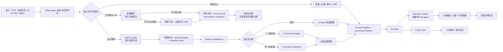

# Office Agent

Office Agent 是一个以 Pi 为执行内核的主动型办公助手。它处理问答、文件总结、多源综合、文档生成与修订、飞书协作、任务建议和会议理解；会议录音会进一步转成带证据的转录与 Meeting Intelligence，再生成纪要和后续办公资产。

当前版本：2026-08-17。运行基线为 Node `>=22.19.0`、Pi `0.84.1`、`pi-subagents@0.46.0`、`@quintinshaw/pi-dynamic-workflows@3.5.1`。

## 当前产品能力

- 通用办公主控：父 Agent 围绕用户目标维护任务状态、选择能力、处理依赖与冲突，并对最终交付负责；会议是能力模块，不是父级身份边界。
- 分层上下文：父级保留 task state、artifact index、决策与开放问题；worker/sub-agent 使用 fresh context 和 task-scoped context pack，不在每次调用反复拼入完整 transcript/evidence。
- 复杂任务分发：一个独立任务用 fresh sub-agent，多个隔离轴用 Dynamic Workflow 并行、校验和综合；中间结果留在 workflow/artifact，不挤占父上下文。
- 云端 ASR 优先：录音文件使用 DashScope 文件转写接口和 OSS；实时流使用独立 WebSocket 接口，二者不混用。
- 公开 URL 知识来源：飞书或本地对话中的显式 YouTube、播客/RSS、小宇宙单集和公开音视频 URL 会进入独立 source-pack 链路；优先官方带时间戳文稿，没有可靠文稿时才下载受限媒体并使用云端 ASR，交付前通过真实 Policy/QA Gate。
- 完整格式矩阵：文件端支持 `.aac/.amr/.avi/.flac/.flv/.m4a/.mkv/.mov/.mp3/.mp4/.mpeg/.ogg/.opus/.wav/.webm/.wma/.wmv`；实时端支持 `pcm/wav/mp3/opus/speex/aac/amr`。
- 单录混音会议：文件 ASR 支持 speaker diarization；robust 模式增加双模型一致性复核。轮流发言可分角色，高重叠同时发言仍不承诺声源级恢复。
- Meeting Intelligence：建立参会人、议题、决策状态、行动项、风险、开放问题和证据映射，驱动检索、写作、标题与 QA。
- 参会人身份：`参会人 A/B/...` 是稳定键；用户映射可确认姓名，也允许用自我介绍、称呼、上下文或登记声纹提出带依据和置信度的候选，但候选不绑定责任或承诺。
- Agentic 编排：简单会议由父 Agent 直接完成；单一核验轴调用 fresh sub-agent；复杂会议运行 Dynamic Workflow 的并行核验、完整性检查、交叉验证与综合。
- 父级证据回收：委派工具完成后，父 Agent 再验证所有 segment id。跨会议或无证据的子 Agent 发现会被隔离，并成为 QA 阻断项。
- 飞书闭环：支持事件接入、附件获取、进度回复、文档生成、QA/Policy Gate、Wiki/Drive 发布和最终回复。
- 双层记忆：会话内短期上下文使用 Pi 原生 Compaction；QA 通过后按需唤醒 `meeting-memory-curator`，只提炼带 Meeting Intelligence claim 与 transcript segment 证据的长期记忆候选。
- 父级记忆治理：父 Agent 校验证据范围、去重并隔离同 key 冲突；记忆子 Agent 只读、fresh、单次运行，失败不会阻塞会议交付。

## 黄金路径



## 仓库结构

| 路径 | 职责 |
| --- | --- |
| `meeting-agent-pi-package/` | Pi package、extensions、skills、prompts、runtime contracts 与测试 |
| `.pi/` | 项目级 Pi system prompt、设置和会议专用 sub-agent 定义 |
| `AgentWorkbench/` | 只读运行观测界面 |
| `src/` | workspace 校验器、共享 schema 与示例 |
| `wiki/` | 当前产品、架构、提示词、技能、权限、测试和历史记录 |
| `runtime-runs/` | 本地运行产物与缓存；已忽略，不进入 Git |

## 文档入口

- [Wiki 导航](wiki/README.md)
- [产品范围](wiki/01-prd.md)
- [Agent 专项架构](wiki/02-agent-architecture.md)
- [当前代码架构](wiki/11-current-project-architecture.md)
- [System Prompt 设计](wiki/03-system-prompts.md)
- [Skill 与工具设计](wiki/04-skill-design.md)
- [权限与凭证边界](wiki/05-feishu-rokid-permissions.md)
- [Agent 与委派角色索引](wiki/06-agent-team-index.md)
- [测试与验收](wiki/07-test-plan.md)
- [运行数据与缓存](wiki/14-local-data-storage-cache-backend.md)
- [公开 URL 与知识 Source Pack](wiki/16-public-url-source-pack.md)

日期化的 `wiki/issues/`、`wiki/plan/`、`wiki/problem/`、`wiki/retrospective/` 和 `wiki/thinking/` 是历史证据，不是当前运行规范。

## 本地安装与运行

```bash
cd meeting-agent-pi-package
npm ci
npm test
```

Pi 项目设置位于 `.pi/settings.json`。包路径相对 `.pi/` 解析，因此当前值必须是 `../meeting-agent-pi-package`。

```bash
set -a
source .env.local
set +a

meeting-agent-pi-package/node_modules/.bin/pi \
  --provider "$PI_PROVIDER" \
  --model "$PI_MODEL"
```

常用配置：

- 主模型：`PI_PROVIDER=deepseek`、`PI_MODEL=deepseek-v4-pro`。
- 审阅模型：`PI_REVIEW_PROVIDER`、`PI_REVIEW_MODEL`；不可用时 Agentic 委派显式尝试主模型并记录 attempts。
- ASR：`MEETING_ASR_PROVIDER=auto|aliyun_dashscope_paraformer|local_qwen3`。
- Agentic 委派：`MEETING_AGENTIC_DELEGATION=auto|off`；当前产品默认 `auto`。
- 长期记忆提炼：`MEETING_MEMORY_CURATION=auto|off`；默认 `auto`，只处理已通过 QA 的完整音频会议。

公开 URL 可通过本地稳定入口直接交给 Agent：

```bash
node meeting-agent-pi-package/tools/public_url_source_cli.mjs \
  --url "https://example.com/public-media"
```

成功后 stdout 返回 `sourcePackPath`；产物位于已忽略的 `runtime-runs/public-url/runs/{runId}/`。`--resolve-only` 只检查来源元数据和获取计划。YouTube 无官方字幕时使用成熟的 `yt-dlp` 取得受限音频；不会读取浏览器 Cookie，也不会绕过登录、付费、DRM 或地区限制。

首次处理 YouTube 可在 macOS 运行 `brew install yt-dlp ffmpeg`。当前真实环境验证与成本口径见 [公开 URL 真实环境验证](wiki/17-public-url-live-validation.md)；Assignment Agent 只生成交接包，是否写入 AI Harness SaaS 或 Obsidian 由外部知识库 Agent 决定。

## 安全与数据边界

办公内容、会议录音、转录、纪要和相关文件可以被当前任务选中的 ASR、模型、sub-agent、workflow、文档与 QA 能力使用。上下文分层、检索与容量控制用于质量和性能，不是内容禁用规则。

以下边界仍然强制执行：

- API Key、Token、Cookie、Authorization、App Secret、签名 URL 与登录会话不得进入 prompt、普通日志、会议产物或长期记忆。
- 公开 URL 只处理用户明确提供的地址；每次 DNS/重定向都校验公网目标，并限制响应大小、媒体大小和时长。完整第三方媒体与转录只保存在已忽略运行目录，source pack 只作为外部知识库交接包。
- 凭证泄漏、高影响、不可逆或目标不明的外部动作进入 Policy Gate；明确目标的用户请求不重复确认。
- 云端 ASR 会把音视频上传至配置的 DashScope/OSS；本地 ASR 不上传媒体。运行产物必须真实记录 provider 和 `rawMediaExternalUpload`。
- 不得把 sub-agent/workflow 的工具成功等同于会议事实成立；父 Agent 的 transcript segment 集合是证据范围真相源。

## 验证

```bash
python3 src/validate_workspace.py
python3 meeting-agent-pi-package/tools/local_ci_check.py
cd meeting-agent-pi-package && npm audit --omit=dev
```

当前自动测试覆盖公开 URL 分类与真实入口、SSRF/重定向/大小边界、官方文稿优先、云端 ASR fallback、source pack provenance，以及 ASR 文件/实时边界、Meeting Intelligence、Agentic 委派、文档、Todo 和长期记忆治理。
