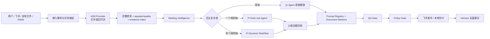

# Meeting Agent

Meeting Agent 是一个以 Pi 为执行内核的会议理解与办公文档 Agent。它接收本地文件、飞书消息与附件、Rokid 导出素材，将音视频转成带证据的转录，构建 Meeting Intelligence，再生成会议纪要及按需的 PRD、技术架构、运营方案和需求确认文档。

当前版本：2026-08-12。运行基线为 Node `>=22.19.0`、Pi `0.84.1`、`pi-subagents@0.46.0`、`@quintinshaw/pi-dynamic-workflows@3.5.1`。

## 当前产品能力

- 云端 ASR 优先：录音文件使用 DashScope 文件转写接口和 OSS；实时流使用独立 WebSocket 接口，二者不混用。
- 完整格式矩阵：文件端支持 `.aac/.amr/.avi/.flac/.flv/.m4a/.mkv/.mov/.mp3/.mp4/.mpeg/.ogg/.opus/.wav/.webm/.wma/.wmv`；实时端支持 `pcm/wav/mp3/opus/speex/aac/amr`。
- 单录混音会议：文件 ASR 支持 speaker diarization；robust 模式增加双模型一致性复核。轮流发言可分角色，高重叠同时发言仍不承诺声源级恢复。
- Meeting Intelligence：建立参会人、议题、决策状态、行动项、风险、开放问题和证据映射，驱动检索、写作、标题与 QA。
- 参会人代号：默认使用稳定的 `参会人 A/B/...`；用户可补充 `参会人 A=张三`，没有实名不阻塞处理。
- Agentic 编排：简单会议由父 Agent 直接完成；单一核验轴调用 fresh sub-agent；复杂会议运行 Dynamic Workflow 的并行核验、完整性检查、交叉验证与综合。
- 父级证据回收：委派工具完成后，父 Agent 再验证所有 segment id。跨会议或无证据的子 Agent 发现会被隔离，并成为 QA 阻断项。
- 飞书闭环：支持事件接入、附件获取、进度回复、文档生成、QA/Policy Gate、Wiki/Drive 发布和最终回复。
- Hermes 学习侧车：可读取会议 trajectory 与证据，生成复盘、记忆、prompt/skill 和 eval 建议；不会直接修改生产能力。

## 黄金路径



## 仓库结构

| 路径 | 职责 |
| --- | --- |
| `meeting-agent-pi-package/` | Pi package、extensions、skills、prompts、runtime contracts 与测试 |
| `.pi/` | 项目级 Pi system prompt、设置和会议专用 sub-agent 定义 |
| `hermes-learning-sidecar/` | 学习侧车、供应链策略与复盘产物生成 |
| `AgentWorkbench/` | 只读运行观测界面 |
| `src/` | workspace 校验器、共享 schema 与示例 |
| `wiki/` | 当前产品、架构、提示词、技能、权限、测试和历史记录 |
| `runtime-runs/` | 本地运行产物与缓存；已忽略，不进入 Git |

## 文档入口

- [Wiki 导航](wiki/README.md)
- [产品范围](wiki/01-prd.md)
- [Agent 专项架构](wiki/02-agent-architecture.md)
- [当前代码架构](wiki/11-current-project-architecture.md)
- [System Prompt 设计](wiki/03-system-prompts.md)
- [Skill 与工具设计](wiki/04-skill-design.md)
- [权限与凭证边界](wiki/05-feishu-rokid-permissions.md)
- [Agent 与委派角色索引](wiki/06-agent-team-index.md)
- [测试与验收](wiki/07-test-plan.md)
- [运行数据与缓存](wiki/14-local-data-storage-cache-backend.md)

日期化的 `wiki/issues/`、`wiki/plan/`、`wiki/problem/`、`wiki/retrospective/` 和 `wiki/thinking/` 是历史证据，不是当前运行规范。

## 本地安装与运行

```bash
cd meeting-agent-pi-package
npm ci
npm test
```

Pi 项目设置位于 `.pi/settings.json`。包路径相对 `.pi/` 解析，因此当前值必须是 `../meeting-agent-pi-package`。

```bash
set -a
source .env.local
set +a

meeting-agent-pi-package/node_modules/.bin/pi \
  --provider "$PI_PROVIDER" \
  --model "$PI_MODEL"
```

常用配置：

- 主模型：`PI_PROVIDER=deepseek`、`PI_MODEL=deepseek-v4-pro`。
- 审阅模型：`PI_REVIEW_PROVIDER`、`PI_REVIEW_MODEL`；不可用时 Agentic 委派显式尝试主模型并记录 attempts。
- ASR：`MEETING_ASR_PROVIDER=auto|aliyun_dashscope_paraformer|local_qwen3`。
- Agentic 委派：`MEETING_AGENTIC_DELEGATION=auto|off`；当前产品默认 `auto`。

## 安全与数据边界

会议录音、转录、纪要和相关文件可以被当前任务选中的 ASR、模型、sub-agent、workflow、文档与 QA 能力使用。上下文分段、检索与容量截断用于质量和性能，不是会议内容禁用规则。

以下边界仍然强制执行：

- API Key、Token、Cookie、Authorization、App Secret、签名 URL 与登录会话不得进入 prompt、普通日志、会议产物或长期记忆。
- 删除、通知他人、日历/任务变更、客户可见发布、权限扩大和依赖安装根据动作影响进入 Policy Gate。
- 云端 ASR 会把音视频上传至配置的 DashScope/OSS；本地 ASR 不上传媒体。运行产物必须真实记录 provider 和 `rawMediaExternalUpload`。
- 不得把 sub-agent/workflow 的工具成功等同于会议事实成立；父 Agent 的 transcript segment 集合是证据范围真相源。

## 验证

```bash
python3 src/validate_workspace.py
python3 meeting-agent-pi-package/tools/local_ci_check.py
cd meeting-agent-pi-package && npm audit --omit=dev
```

当前自动测试覆盖 ASR 文件/实时边界、格式矩阵、speaker diarization、单录混音复核、Meeting Intelligence、参会人别名、Pi 0.46 Sub-agent API、Dynamic Workflow 生成、真实工具事件解析、模型回退和父级证据隔离。
