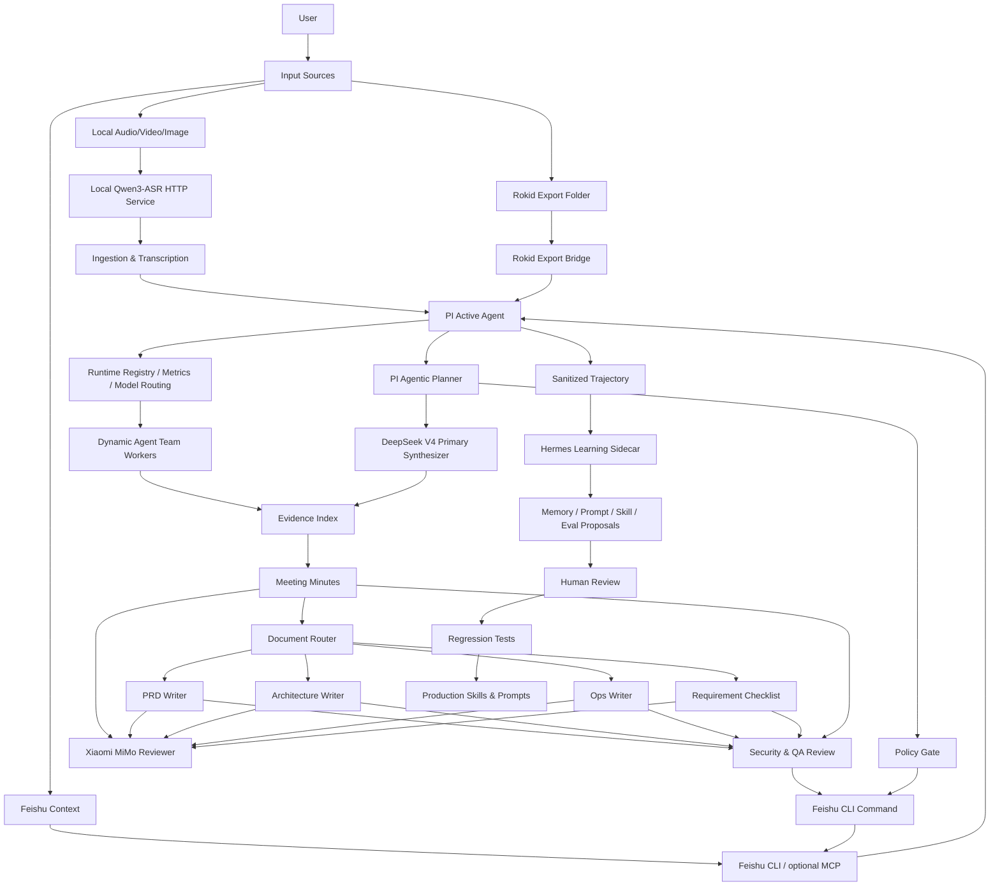

# PI + Hermes Agentic Office Runtime 架构文档

## 1. 架构原则

- 执行权和进化权分离：PI 执行真实任务，Hermes 只做事后学习建议。
- Agentic Planner 优先：PI 根据用户目标、成功标准和约束动态选择 capability、工具和 worker；不得把全局运行时固化为固定 DAG、固定状态机或会议专用 workflow。
- 模型分工可路由：Model Router 是唯一模型入口。普通短任务默认 `deepseek/deepseek-v4-flash`；会议纪要、PRD、技术架构、复杂运营/客户需求清单和用户明确要求深度思考的任务默认 `deepseek/deepseek-v4-pro`；小米 MiMo 默认复核/补充/兜底，本地 Qwen3-ASR 只负责音频转文字。模型不可用时允许按 `model-routing.json` 自动 fallback，但必须记录 `model-route.json`，不得静默切换。
- 音频默认不外发：原始音频只进入本机 ASR 服务；DeepSeek 和小米默认接收 transcript/evidence 文本，不需要逐次确认。
- 上下文默认 pointer-only：长会议 raw transcript/full evidence 写入本地 offload artifact，主上下文只保留 pointer、hash、bounded preview、topicMap、evidence map、QA gate 和 open questions。
- Policy Gate 只拦截越界动作：客户可见发布、通知他人、日历/任务变更、依赖安装、外部联网、长期记忆写入、原始媒体外发等需要 gate；gate 不规定业务流程。
- Planner Envelope 记录每次非平凡 run 的目标、能力、工具、worker、policy 风险、artifact 和停止条件，是当前任务的 scenario playbook，不是可复制到所有任务的固定 workflow。
- Capability Registry 条目是 planner-selectable capability descriptions，必须包含 `description`、`toolIntents`、`policy`、`observability`、`installState` 和 `securityReview`。
- 工具权限清晰：飞书走官方 `lark-cli` 当前登录态，Rokid、文件系统、外部模型调用按任务授权。
- 飞书输出默认脱敏：auth status 只能返回 `auth-status-summary`，其他进入模型上下文的 CLI 输出使用 `secret-scan`。
- 文件导入优先：Rokid 第一阶段按导出文件处理，不假设成熟官方 MCP。
- 输出可追溯：会议纪要和后续文档的关键判断必须能回溯到内部 evidence；用户可见正文不暴露 raw evidence id、chunk id 或源音频文件名。
- 飞书能力不复刻：PI 不维护 Feishu Adapter、action enum、approval-store 或默认 dry-run。
- 供应链先审计再运行：Hermes 及其依赖不得绕过 dependency policy。

## 2. 总体分层

```text
User / Files / Rokid Export / Feishu
        |
        v
Active Execution Plane: PI Agent
        |
        +-- PI Agentic Planner: goal / capability plan / tool plan / worker plan
        +-- Policy Gate: privacy / publish / notify / calendar / task / web / install / memory
        +-- Control Model: DeepSeek V4 primary synthesis/document generation
        +-- Review Model: Xiaomi MiMo review/fallback
        +-- Runtime Plane: metrics / capability registry / model routing / QA gate / context offload
        +-- Agent Team Runtime: dynamic worker components by task
        +-- Procedure Plane: skills + prompts
        +-- Integration Plane: local ASR HTTP API / official lark-cli / rokid / optional confirmation
        +-- Evidence Plane: artifacts / transcript / evidence index
        +-- Governance Plane: credential hygiene / dependency policy / trajectory sanitization
        |
        v
Outputs: minutes / PRD / architecture / ops / checklists / Feishu results
        |
        v
Sanitized Trajectory
        |
        v
Learning Plane: Hermes sidecar
        |
        v
Human Review -> Regression Tests -> Skill/Prompt/Eval updates
```

### 2.1 Agentic Runtime Target

PI 的目标运行时不是强制 orchestrator，而是能力可组合的 agentic runtime：

```text
User Goal
  -> PI Agentic Planner
  -> Capability Registry
  -> Policy Gate
  -> Tool Execution
  -> Runtime Observability
  -> Learning Sidecar
```

Planner 负责自由拆任务、选择能力、组装工具、判断是否启用 dynamic worker pool；Capability Registry 负责 lazy load；Policy Gate 只判断动作是否越界；Tool Execution 执行 ASR、Feishu、Docs、Calendar、Tasks、Search、Writer、QA 等能力；Runtime Observability 记录能力、上下文、模型、artifact 和风险；Hermes/Learning Sidecar 只做事后 proposal。

运行层的可观测字段必须覆盖 `plannerDecisions`、`capabilitySelections`、`policyDecisions`、`workerDecisions` 和 `packageAudits`。第三方包只能通过 package audit/install mechanism 从 candidate 进入 enabled：记录来源、版本、依赖、环境变量、网络访问、文件写入和 prompt 注入风险，安装动作必须经过 `install_dependency` Policy Gate。

本地 Docker 常驻运行边界是 **Host 原生控制面 + Local Docker 受限执行面**。本地 Docker 不能减少本机总计算消耗，只用于进程隔离、资源上限、队列深度和后台常驻。Host 保留 Feishu live、`lark-cli`、macOS keychain、附件下载/发布/回复、本机 MLX ASR 和 `document_revision` 评论上下文预取；Local Docker 只运行 Redis queue、bounded document worker 和 Hermes proposal worker。`fast_answer/file_summary 不进 Docker`；`document_generation/multi_source_synthesis 默认进 Docker worker`；`audio_minutes` 的 raw audio 不进容器，先在 Host 完成 audio normalize + local ASR；默认档位是 `4 CPU / 8GB / 长文档并发 2`。

```bash
docker compose -f docker-compose.local-runtime.yml up -d runtime-queue pi-document-worker hermes-worker
```

### 2.2 Planner Envelope / Policy Gate Contract

Planner Envelope 最小字段：

```json
{
  "goal": "用户真实目标",
  "taskType": "meeting_minutes|doc_writer|feishu_bot|calendar|task_management|research|mixed",
  "successCriteria": [],
  "constraints": [],
  "capabilitiesNeeded": [],
  "toolPlan": [],
  "parallelizableWorkers": [],
  "policyRisks": [],
  "requiredArtifacts": [],
  "stopConditions": []
}
```

Policy Gate 只接收动作边界判断，例如 `read`、`draft`、`write_private`、`publish_customer_visible`、`notify_people`、`mutate_calendar`、`assign_task`、`external_web`、`install_dependency`、`persist_memory` 和 raw media external upload。输出只允许 `pass|needs_confirmation|blocked`，并提供原因、确认需求和安全替代方案；不得输出业务步骤表。

### 2.3 当前代码同步状态

当前代码实现以 `meeting-agent-pi-package/` 为执行平面，详见 `wiki/11-current-project-architecture.md`。关键实现状态：

- Runtime extensions 已覆盖 Planner Envelope、Policy Gate、Capability Registry、Runtime Metrics、Model Routing、Model Provider、Document Generation、Document Worker、QA Gate、Context Offload、Feishu、Rokid、Local ASR 和 Agent Team Runtime。
- 文档生成只走 `document-prompt-registry.json -> document_prompt_render_batch -> document_workers_run`，不再在 worker 中硬编码 PRD、运营、架构或 checklist scaffold。
- `document_workers_run` 当前是三层粒度：先按 registry `dependsOn` 生成 dependency waves，再在同一 wave 内按 docType 并行，最后在每个 document worker 内按 registry `requiredSections` 做 section batches、merge 和 bounded repair。
- 多文档依赖基线是 `prd -> tech-architecture -> customer-requirement-checklist`。技术架构必须基于会议/evidence 与 PRD；客户确认表定位为 FDE（前端部署工程师）沟通清单，必须基于会议/evidence、PRD 和技术架构提取待确认项。
- `model-route.json` 必须记录 `sectionBatches`、`sectionAttempts`、`repairAttempts`、`missingSections` 和 fallback 结果；不得记录 renderedPrompt、secret、raw request body 或 raw media。
- 本地 Docker worker 通过 `local_docker_runtime_queue.mjs` 入队，只消费 bounded artifacts，不接收 Feishu token、App Secret、CLI session、cookie 或 raw audio/video；`local_docker_document_worker.mjs` 只写 `agent-output.json`，不调用 `lark-cli`、不 publish、不 reply。
- 后续发现开发问题或架构偏差时，必须在 `wiki/issues/` 中新增 issue markdown，不能只留在聊天或临时 runtime artifact 中。

## 3. 架构图

下图是会议纪要/文档生成场景的 reference playbook，不代表所有办公任务都必须经过同一条 workflow。



## 4. 核心模块

### 4.1 PI Active Agent

职责：

- 接收用户任务、输入路径、成功标准和约束。
- 作为 PI Agentic Planner 动态选择 skill、prompt、capability、tool 和 worker。
- 调用媒体、飞书官方 CLI、Rokid 和可选确认工具。
- 默认普通短任务使用 `deepseek-v4-flash`；会议纪要和深度文档使用 `deepseek-v4-pro`；小米 MiMo 做证据复核和兜底。
- 使用 Policy Gate 检查客户可见发布、IM/日历/任务变更、外部联网、安装依赖、长期记忆写入和原始媒体外发等风险动作。
- 使用 `model_route_plan` 选择任务模型；provider 不可用时可自动 fallback，并通过 `model_route_record` 写入 `model-route.json`。
- 使用 Lazy Capability Registry 按任务启用 Feishu、Rokid、WebAccess/MCP、Agent Team、Context Offload 等能力。
- 长会议或多文档任务可调用动态 Agent Team worker 并行抽取 topicMap、evidence coverage、entity gate、风险/开放项和 document shard。
- 使用 `context_offload_write` 将长 transcript/full evidence 写成本地 artifact，主上下文保留 pointer-only 摘要。
- 维护当前任务状态。
- 输出最终文档和脱敏 trajectory。

不负责：

- 自动合入自优化建议。
- 持久保存原始会议内容到长期记忆。
- 把飞书官方 CLI 凭证、session 或 token 写入仓库。
- 把原始音频、原始视频或 base64 音频提交给 DeepSeek、小米、飞书、Hermes 或其他外部服务。
- 把旧固定角色拆分文档当作必须常驻加载的固定 subagent role。

### 4.2 Local ASR + Media Pipeline

职责：

- 读取本地音频、视频、图片。
- 计算 hash。
- 生成 artifact metadata。
- 通过本机 Qwen3-ASR HTTP 服务转写音频。
- 建立 evidence index。

第一阶段实现最小能力：文件识别、hash、metadata、本地 ASR 转写、文本证据索引。

本地 ASR 服务边界：

- 服务入口：`meeting-agent-pi-package/tools/local_asr_http_service.py`。
- 默认 URL：`http://127.0.0.1:8765`。
- 默认模型：`models/Qwen3-ASR-1.7B-MLX-4bit`。
- PI 工具：`meeting_transcribe_local_asr`。
- 输出：`sources.json`、`transcript.full.json`、`evidence-index.json`、`summary.json`。
- 故障：服务不可用时阻塞为 `local_asr_service_unavailable`，不自动改走小米/DeepSeek/脚本兜底。

### 4.3 Rokid Export Bridge

定位：

第一阶段按 Rokid 导出文件做本地导入，不假设稳定官方 Rokid MCP。若后续出现成熟官方 MCP，可作为可选能力通过 capability registry 和 policy gate 接入。

工具草案：

- `rokid.list_exports(root, since?)`：列出导出目录中的候选文件。
- `rokid.import_artifact(path, meeting_id?)`：导入文件并生成 artifact metadata。
- `rokid.get_metadata(artifact_id)`：读取导入元数据。
- `rokid.mark_processed(artifact_id, status)`：标记处理状态。

后续可扩展：

- 手机端 companion app。
- 眼镜端轻量采集 app。
- 实时音频流。
- 图片帧/视频片段实时入库。

### 4.4 Feishu Integration

优先工具：

- 官方 `lark-cli`：唯一飞书能力来源，适合 agent 操作飞书文档、Wiki、IM、日历、任务、会议记录、Sheets、Base 等。
- Feishu Agent bridge：CLI-first 双向入口，适合机器人接收用户消息、下载附件、触发本地 PI task、发布文档并回复状态。
- Feishu bot event gateway：可选 SDK 长连接入口，适合在 CLI event consume 不稳定或需要 SDK 长连接时把事件转发到同一个 handler。

能力：

- 通过 `feishu_cli(args, stdin?, timeoutMs?, parseJson?)` 直接调用 `lark-cli ...args`。
- 读取、创建、更新、移动、发送 IM、创建任务、修改日历等能力都由官方 CLI 子命令提供。
- 不做命令白名单，不复刻官方 CLI 子命令，不保存飞书凭证。
- 机器人回应需要订阅 `im.message.receive_v1`；推荐主路径是 `lark-cli event consume <EventKey> --as bot` -> `tools/feishu_event_runner.mjs` -> `tools/feishu_agent_task_handler.mjs`。
- Handler 输出 `event.json`、`task.json`、`state.json`、`agent-task.md`、`agent-output.json`、`publish.json`、`reply.json`，并只在 QA/Policy 允许时执行 live publish。
- 可选长连接服务 `tools/feishu_bot_event_gateway.mjs` 配置 loopback `FEISHU_BOT_HANDLER_URL=http://127.0.0.1:8788/feishu/events` 后默认进入 HTTP handler 模式；handler 可用 `FEISHU_AGENT_ASYNC=1` 先返回 `runId`，凭证只从环境变量读取。
- MCP 只作为可选 AI 工具层，不是机器人接收消息、回复消息或发布文档的必需服务。

### 4.5 Document Router

输入：

- 会议纪要草稿。
- evidence index。
- 用户目标。
- 可选项目上下文。

输出：

- `documents`：有 evidence 支撑的目标 docType。
- `reasoning`：每个 docType 的选择理由。
- `evidence_ids`：内部证据引用，用户可见文档不得直接暴露 raw id。
- `missing_inputs`：高质量生成仍缺少的输入。
- `approval_required`：发布或协作动作所需审批。

### 4.6 Hermes Learning Sidecar

职责：

- 读取脱敏 trajectory。
- 发现重复流程问题。
- 输出 proposal。
- 生成回归测试建议。

禁止：

- 访问飞书/Rokid token。
- 读取原始音视频。
- 直接修改生产 skill/prompt。
- 执行飞书写动作。

## 5. 数据模型草案

### MeetingArtifact

```json
{
  "artifact_id": "art_20260516_001",
  "meeting_id": "meet_20260516_customer_a",
  "source": "local|rokid_export|feishu",
  "path": "/absolute/path/to/file",
  "media_type": "audio|video|image|text",
  "sha256": "hash",
  "privacy_level": "internal|customer|confidential|restricted",
  "created_at": "2026-05-16T10:00:00+08:00",
  "imported_at": "2026-05-16T10:20:00+08:00",
  "status": "imported|transcribed|indexed|failed"
}
```

### TranscriptSegment

```json
{
  "id": "record-20260514-144424-6a-c000-s1",
  "sourceFile": "record-20260514-144424-6a.wav",
  "sourceHashSha256": "hash",
  "chunkIndex": 0,
  "startSec": 0,
  "endSec": 30,
  "text": "这次 MVP 先聚焦本地素材分析和检索。",
  "model": "mlx-community/Qwen3-ASR-1.7B-4bit",
  "endpoint": "local-mlx-metal"
}
```

### EvidenceChunk

```json
{
  "evidence_id": "ev_001",
  "meeting_id": "meet_20260516_customer_a",
  "source_segment_ids": ["seg_001", "seg_002"],
  "claim": "MVP 应先聚焦本地分析和检索。",
  "tags": ["mvp", "scope", "product"],
  "confidence": "high"
}
```

### DocumentRequest

```json
{
  "meeting_id": "meet_20260516_customer_a",
  "document_type": "minutes|prd|technical_architecture|ops_plan|requirement_checklist|retro",
  "audience": "internal|customer|partner",
  "evidence_ids": ["ev_001"],
  "known_gaps": ["客户是否允许第三方 API"]
}
```

### OptionalConfirmation

```json
{
  "action": "publish_review",
  "target": "wiki_node_or_chat_id",
  "summary": "用户要求发布前确认",
  "visibility": "customer_visible",
  "risk": "可能暴露未确认需求或内部判断",
  "status": "approved|rejected"
}
```

### SanitizedTrajectory

```json
{
  "trajectory_id": "traj_001",
  "meeting_type": "product_requirement",
  "input_summary": "1 audio file, 1 feishu context doc",
  "output_types": ["minutes", "prd", "requirement_checklist"],
  "quality_signals": {
    "missing_owner_count": 2,
    "evidence_coverage": 0.84
  },
  "sanitization": {
    "contains_raw_transcript": false,
    "contains_tokens": false
  }
}
```

## 6. Phase 实施

### Phase 0

- 完成文档和数据模型。
- 明确 `agent.md` 开发规则。
- 建立 dependency policy。

### Phase 1

- 实现本地 artifact metadata、转写、证据索引、纪要和文档路由。
- Writer prompts 先以模板输出，不依赖复杂长期记忆。

### Phase 2

- 集成 `feishu_cli` 官方 `lark-cli` 直通。
- 支持官方 CLI help 和全量子命令能力发现。
- 可选 confirmation checkpoint 只在用户要求时使用。

### Phase 3

- 实现 Rokid Bridge 的本地目录工具。
- 不做实时采集。

### Phase 4

- 输出脱敏 trajectory。
- Hermes sidecar 生成 proposal。
- 人工 review + 回归测试。

### Phase 5

- 加入多项目知识库、飞书同步状态和 observability。

## 7. 失败模式

- 转写质量低：输出 confidence，并要求人工补充关键段落。
- 飞书权限不足：返回缺失 scope，不尝试越权。
- Rokid 文件格式未知：保留 artifact metadata，标记为 unsupported。
- 文档证据不足：生成待确认问题，而不是编造。
- Hermes 依赖不合规：禁止运行并输出供应链审计失败。
