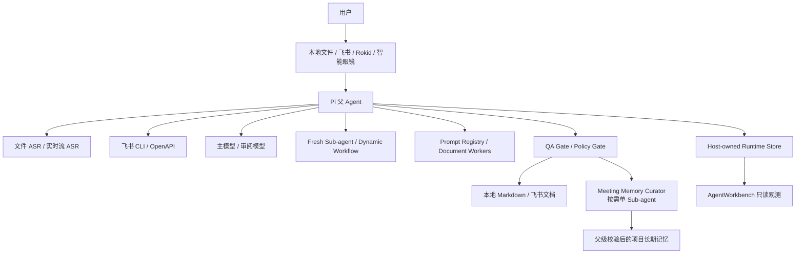
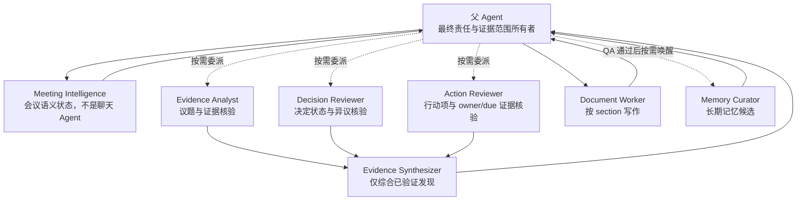
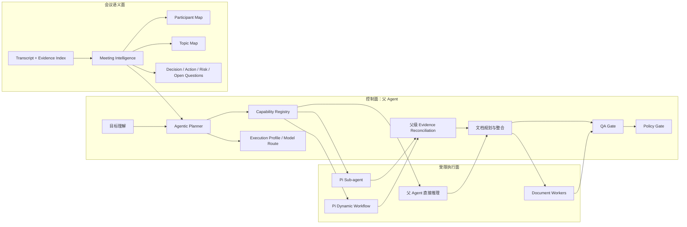
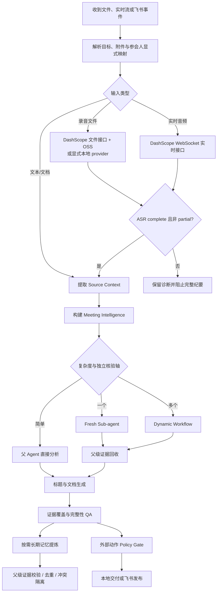
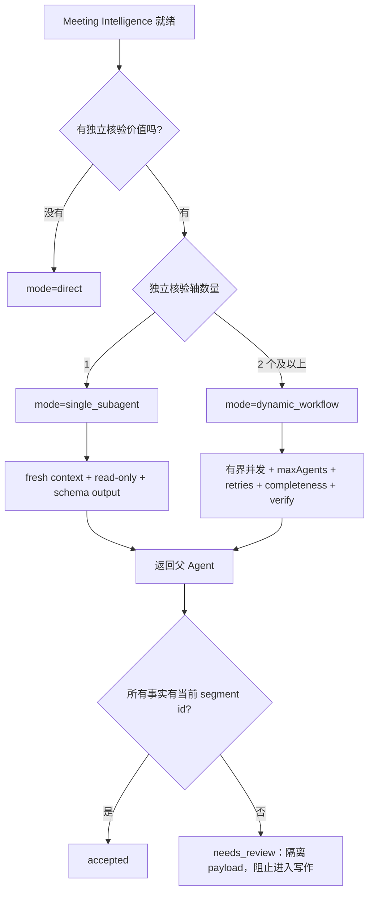
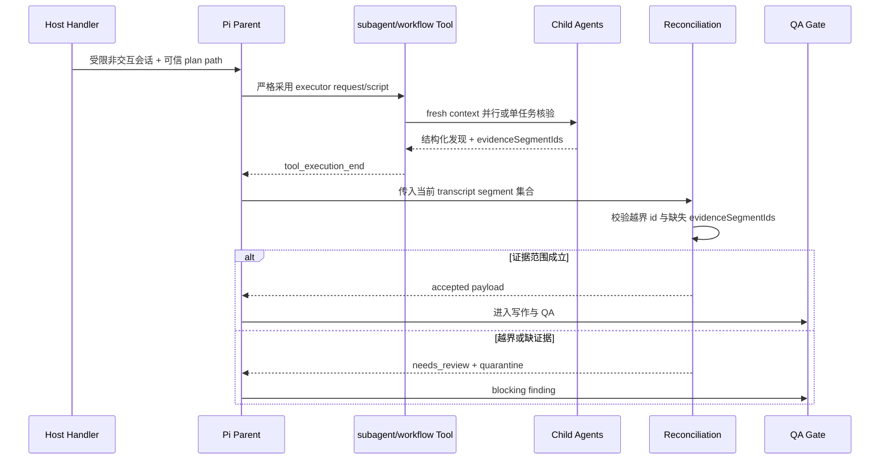
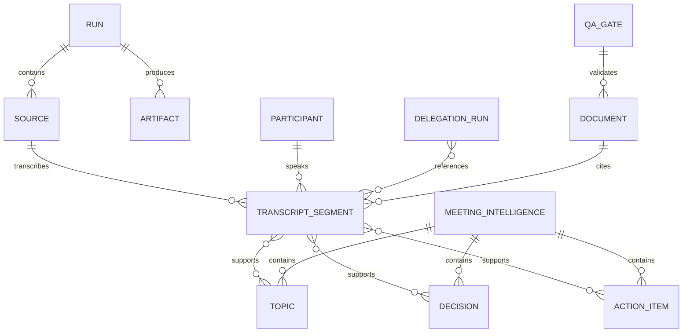
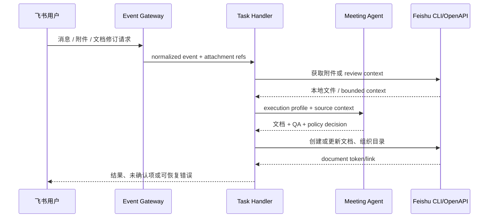
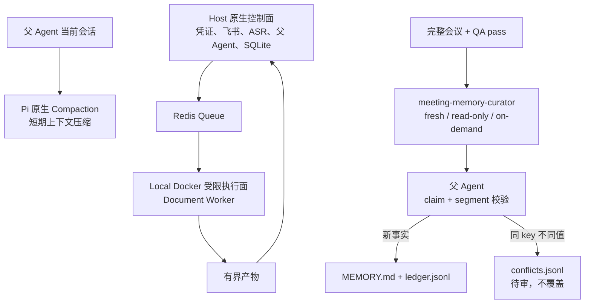

# Meeting Agent：Agent 端专项架构

更新时间：2026-08-12。

本文是当前 Agent 架构的唯一详细说明。它描述系统如何从会议证据形成判断、何时委派、如何回收证据，以及怎样把结果交付到本地或飞书。代码目录映射见 [11-current-project-architecture.md](11-current-project-architecture.md)。

## 1. 架构目标

Agent 的核心职责不是把一组步骤按顺序跑完，而是围绕当前用户目标持续选择最合适的能力，并对最终结果负责。

- 会议证据优先：事实、决定、行动项和风险必须能回到当前 transcript segment。
- 单一责任主体：父 Agent 拥有最终判断、冲突处理、文档交付和外部动作权限。
- 自适应委派：简单任务直接完成；一个独立核验轴用 fresh sub-agent；多个核验轴才用 Dynamic Workflow。
- 语义状态贯穿：Meeting Intelligence 同时服务 Planner、检索、委派、写作和 QA。
- 内容可用、凭证隔离：会议内容可以进入所选能力；凭证永远不得进入模型、普通日志或产物。
- 失败透明：partial ASR、委派未执行、模型回退、证据越界和发布失败分别记录。

## 2. 系统上下文

Pi 父 Agent 是系统中心，但不独占全部推理。ASR、Meeting Intelligence、sub-agent、workflow 和文档 worker 都提供专门能力；父 Agent 负责选择、组合、校验和交付。

## 3. Agent 角色关系

`.pi/agents/*.md` 定义会议专用角色。核验者是 fresh context、任务型、只读角色；不能发布飞书、修改生产配置或取代父 Agent。`meeting-memory-curator` 同样 fresh、只读，但通过固定 project memory scope 形成可重复唤醒的持久角色：它可以读取父级已经接受的 `MEMORY.md` 识别重复或冲突，却不能自行写记忆。`agent-team-runtime` 仍保留为兼容 fallback，但不是主编排架构。

## 4. 运行控制面

Planner Envelope 记录目标、输入、Meeting Intelligence 摘要、候选能力、模型路线、预期产物和风险。它是可审计决策，不是全局固定 workflow。Capability Registry 提供 planner-selectable capability descriptions；Policy Gate 只判断动作边界，不替 Agent 编排业务。

## 5. 会议黄金流程

文件端和实时流端是两个能力端口。文件端接受产品声明的完整媒体格式矩阵，通过 OSS 提交异步文件转写；实时流端接收编码帧并使用 WebSocket。只有 provider 拒绝容器或本地模型需要时才派生转码文件，不能把本地模型输入格式误写成产品格式限制。

## 6. 委派决策

委派不是按时长机械触发。Agentic Planner 结合议题数量、决定与行动项密度、冲突、低置信证据和用户交付物判断。简单会议启动多个 Agent 只会增加延迟和冲突，因此保持 direct。

## 7. Sub-agent / Workflow 执行时序

自动入口运行受限的 Pi 父会话，工具 allowlist 为 `read,subagent,workflow`。模型按审阅模型、主模型、默认主模型顺序尝试，并把 attempts 写入 artifact。只有观察到匹配工具的 `tool_execution_end`，才算真实执行；自然语言声称“已经核验”不算执行证据。

## 8. 证据、状态与产物关系

主要运行产物：

| 产物 | 作用 |
| --- | --- |
| `summary.json` | run 总状态、provider、失败与交付摘要 |
| `transcripts/transcript.full.json` | 完整 segment 及时间、speaker、quality |
| `evidence/evidence-index.json` | 当前证据范围真相源 |
| `participant-map.json` | speaker id、稳定代号和用户显式姓名 |
| `meeting-intelligence.json` | 会议类型、议题、决定、行动、风险、开放问题 |
| `agentic-orchestration-plan.json` | direct/sub-agent/workflow 选择与 executor 参数 |
| `agentic-orchestration-result.json` | 真实工具事件、模型 attempts 和父级回收结果 |
| `model-route.json` | 主模型、审阅模型、fallback 和调用状态 |
| `qa-gate.json` / `policy-gate.json` | 内容质量与外部动作边界 |
| `meeting-memory/curation-plan.json` | 单一 Memory Curator 的可信输入与 schema |
| `meeting-memory/curation-result.json` | 模型 attempts、父级 rejection、去重和冲突结果 |
| `.pi/agent-memory/meeting-memory/MEMORY.md` | 最多 200 行的当前项目长期记忆视图 |
| `.pi/agent-memory/meeting-memory/ledger.jsonl` | 父级接受的 append-only 记忆审计账本 |

完整 transcript 可由工具按任务读取；offload、检索和 bounded preview 用于控制上下文质量与成本，不是会议内容隐私禁令。运行指标仍不保存 raw transcript 或凭证。

## 9. 飞书闭环

Inbound 的明确非删除写作请求可进入执行；删除、清空、通知他人、日历/任务变更、权限扩大与依赖安装仍按动作影响处理。飞书 handler 编排运行和发布，不硬编码会议内容结构。

## 10. Host、Docker 与双层记忆

本地 Docker 不能减少本机总计算消耗，只用于隔离、资源上限、队列和后台常驻。`fast_answer/file_summary 不进 Docker`；`document_generation/multi_source_synthesis 默认进 Docker worker`（仅在 queue 模式开启时）；`raw audio 不进容器`。默认资源档位为 `4 CPU / 8GB / 长文档并发 2`。

双层记忆不引入第二套 Agent runtime。短期上下文直接使用 Pi 原生 Compaction；长期记忆只在完整音频会议通过 QA 后运行一个 `meeting-memory-curator` 子任务。该角色的定义与 memory scope 持久存在，但每次执行都是 fresh 子进程。父 Agent 才是唯一写入者，并用 Meeting Intelligence claim、当前 transcript segment、用户显式姓名映射、credential scan、去重和冲突检查守住边界。记忆失败不阻塞纪要，飞书发布也不是记忆提炼的前置条件；curation plan/result/events 只进入本地 run manifest 和 Workbench 观测，不作为飞书交付附件上传。

## 11. 失败与降级

| 失败 | 系统行为 | 是否继续交付完整纪要 |
| --- | --- | --- |
| 文件 ASR 鉴权/OSS/网络/模型失败 | 保存脱敏诊断；按配置显式尝试 provider fallback | 否，除非另一 provider 完整成功 |
| ASR partial 或零 segment | 标记 blocked，保留已有片段供诊断 | 否 |
| Diarization 不可用 | 保留 transcript，speaker 统一匿名且标记限制 | 可，但不得虚构 speaker 归属 |
| 高重叠同时发言 | robust 复核并标记 overlap/needs_review | 可，但不能承诺恢复缺失语音 |
| 审阅模型 401/失败 | 记录 attempt，尝试主模型 | 可 |
| Sub-agent/workflow 未产生工具完成事件 | 回到父级 review，并记录未委派 | 可，不能声称委派成功 |
| 子 Agent 引用跨会议 segment id | 隔离整个委派结果并加入 QA blocker | 否，直到重新核验或去除依赖 |
| Memory Curator 失败或输出无效 | 记录 blocked/rejected artifact，不更新长期记忆 | 是，记忆是非阻塞增强能力 |
| 长期记忆同 key 出现不同值 | 写入 `conflicts.jsonl` 待审，不覆盖当前记忆 | 是 |
| 飞书发布失败 | 本地产物保留，返回可恢复错误 | 本地可交付，云端未完成 |

## 12. 代码落点

| 架构职责 | 主要代码 |
| --- | --- |
| 父 Agent 工作方式 | `.pi/SYSTEM.md` |
| 会议角色 | `.pi/agents/*.md` |
| Planner / Policy / Capability | `extensions/planner-runtime.ts`、`policy-gate.ts`、`capability-registry.ts` |
| Agentic 计划 | `extensions/meeting-agentic-orchestrator.ts`、`tools/meeting_workflow_helpers.mjs` |
| Pi 执行与父级回收 | `tools/pi_meeting_orchestration_helpers.mjs` |
| ASR 文件与实时流 | `tools/dashscope_asr_client.mjs`、`asr_media_formats.mjs` |
| 单录混音复核 | `tools/single_mix_asr_helpers.mjs` |
| Meeting Intelligence | `tools/meeting_intelligence_helpers.mjs` |
| 双层记忆 | `.pi/settings.json`、`.pi/agents/meeting-memory-curator.md`、`tools/meeting_memory_helpers.mjs` |
| 文档生成 | `extensions/document-generation.ts`、`document-worker-runtime.ts`、`prompts/*.md` |
| 飞书入口 | `tools/feishu_bot_event_gateway.mjs`、`feishu_agent_task_handler.mjs` |
| QA / 可观测 | `extensions/qa-gate.ts`、`runtime-observability.ts` |
| 运行存储 | `tools/runtime_store_cli.py` |

## 13. 不变量

- 父 Agent 始终是最终责任主体。
- Meeting Intelligence 不被 sub-agent 私有状态取代。
- 工具成功不等于证据接受。
- 当前 transcript segment 集合是委派证据范围真相源。
- 文件 ASR 与实时流 ASR 不共用端口契约。
- speaker diarization 不等于声源分离。
- QA Gate 判断内容是否可交付；Policy Gate 判断动作是否可执行。
- Pi 原生 Compaction 是短期上下文机制，不是长期事实库。
- Memory Curator 只能提出候选；父 Agent 是长期记忆唯一校验与写入者。
- 同 key 冲突不得自动覆盖，记忆失败不得阻塞会议交付。
