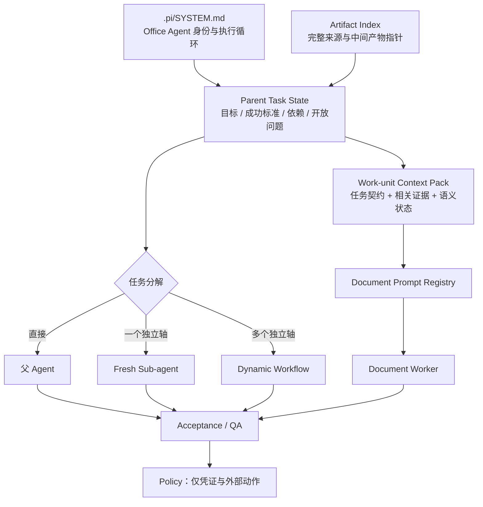
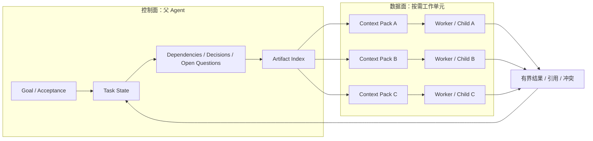

# Office Agent System Prompt 与上下文架构

更新时间：2026-08-12。

当前提示词系统的中心是主动型办公助手，而不是会议纪要流水线。会议理解、文档写作、飞书协作、多源综合、修订和研究都是父 Agent 按目标选择的能力模块。本文描述当前契约，不复制生产 Prompt 全文。

## 1. Prompt 分层

| 层 | 真相源 | 职责 |
| --- | --- | --- |
| Parent System | `.pi/SYSTEM.md` | 通用办公身份、Agentic 循环、委派与最终责任 |
| Task Control | `planner-envelope.json` / Adaptive Execution Ledger | 唯一任务真相源：目标、成功标准、步骤、依赖、验收、结果引用、开放问题和用户选择 |
| User Projection | Todo / 飞书回复 / channel state | 从 Ledger 派生的进度、客户问题和下一步选择；不独立决定完成 |
| Artifact | source records/segments、完整 transcript、结构化分析 | 保存可按需读取的完整数据，不占据每个模型调用 |
| Domain State | Meeting Intelligence 等 | 为特定场景提供结构化语义；不取代父 Agent |
| Work Unit | `context-pack-v2` | 给一个 worker/child 的任务契约、相关证据、artifact index 和输出契约 |
| Document | registry + `prompts/*.md` | 文档类型的受众、逻辑、结构和质量自检 |
| QA | `qa-gate.ts` | 检查错误交付风险，优先自动修复或降级披露 |
| Policy | `policy-gate.ts` | 凭证和高影响外部动作；不规定业务流程 |

## 2. 父 Agent Prompt

`.pi/SYSTEM.md` 现在定义 Office Agent，而不是“会议终结 Agent”。核心行为是：

- 先建立目标、交付物、成功标准、来源、约束和开放问题，再选择能力。
- 普通问答、单文件总结和局部修订直接处理；Meeting Intelligence 只在会议场景启用。
- 按“理解 → 计划 → 执行 → 观察 → 更新状态 → 验收”循环推进，新证据可改变计划；依赖和验收由 Adaptive Execution Ledger 强制表达。
- Todo 只投影 Ledger 中的进度、问题和下一步选择。用户修改 Todo 后由父 Agent reconcile 回 Ledger，不建立第二套任务状态。
- 一个独立工作轴使用 fresh sub-agent；多个输入输出可隔离的轴才使用 Dynamic Workflow。
- 父 Agent 保留跨任务状态、冲突裁决、最终质量和外部动作责任。
- 显式用户请求与明确目标构成授权；只有高影响、不可逆或目标不明时才询问。

## 3. 复杂任务上下文

旧描述容易被理解成“把长 transcript 与 evidence 截断后不断拼接”。当前实现改为两层：

父上下文不保存每份来源全文，而保存任务状态、artifact 路径、hash、依赖输出摘要与下一步。完整 transcript/evidence 保留在 artifact；work unit 只得到当前任务相关证据。Dynamic Workflow 的中间结果保留在脚本变量和运行 artifact 中，只把综合结果送回父级。

这适合复杂任务的原因不是“截断更多”，而是隔离：每个 child 拿 fresh context，不被其他议题污染；父 Agent 只管理控制信息。当前检索仍是确定性 section/keyword + Meeting Intelligence 引导，还不是语义向量检索；context pack 不足时必须由父级补取并重建，worker 不能自行假装读取全文。

Pi 原生 Compaction 只负责长父会话的历史压缩。它不替代 task state、artifact、领域语义状态或长期记忆。

## 4. 会议纪要 Prompt

`prompts/meeting-minutes.md` 先要求模型恢复会议叙事，再写章节：

- 会议目的、持续议题、议题关系和当前状态。
- 事实、推断、建议、待确认四层内容。
- 提议、异议、讨论、共识、否决和未决的差异。
- 主要议题内的动态三级结构，而不是按时间轴或固定行业模板复述。
- 行动内容、owner、期限和验收条件分别判断。
- 文件名/H1 同源，但低置信身份候选不进入标题。

## 5. 参会人身份策略

`参会人 A/B/...` 始终是稳定身份键。实名分为：

1. `user_confirmed`：用户显式映射，可直接使用。
2. 已登记声纹匹配：有现存 voiceprint identity，可视为确认来源。
3. `candidateName`：由自我介绍、明确称呼、上下文关系或声纹匹配提出，必须附 `candidateBasis`、segment evidence 与 `candidateConfidence`。

候选身份的用户可见写法为“参会人 A（可能为张三，待确认）”。未知 speaker id/声纹聚类不能凭空产生姓名；候选不得用于确定 owner、承诺、权限、预算或长期身份记忆。

## 6. Sub-agent 与 Workflow Prompt

当前项目角色分两类：

- 通用办公：`office-source-analyst`、`office-deliverable-reviewer`。
- 会议专项：evidence、decision、action、synthesizer、memory curator。

每个角色必须收到单一任务、可读 artifact、引用范围和输出契约。普通独立核验使用 Pi subagent；多个隔离轴、完整性检查与交叉验证使用 Dynamic Workflow。不要用 workflow 代替一个普通工具调用，也不要让 child 持有发布和生产写权限。

## 7. 精简后的 Gate

已精简的过度防御：

- 低置信 document identity 从 `needs_fix` 降为 warning，优先自动改善标题。
- 未确认姓名候选不再一律视为违规；只要求 alias、候选标识、依据和置信度。
- 评论 API/独立评论线程不完整时继续处理明确用户指令和可读正文，并披露覆盖范围。
- web research 不再要求额外“会议事实默认不联网”授权；用户需要最新资料时可检索，但必须记录来源并与会议事实分层。
- 删除不再永久硬禁；只有精确目标和用户确认同时存在才执行，否则请求确认或给可逆替代。
- 明确目标的发布、通知、任务或日历请求不重复确认。

继续保留的硬边界：凭证泄漏、跨会议证据污染、把低置信 ASR 升级为确定承诺、未明确目标的覆盖/删除，以及高影响动作的授权。

## 8. 维护与验证

- 全局 Office Agent 行为只在 `.pi/SYSTEM.md` 维护。
- 文档逻辑在 `prompts/*.md` 与 registry 维护。
- 角色定义在 `.pi/agents/*.md` 维护。
- runtime 代码只组装任务契约、上下文和工具调用，不复制整份业务 Prompt。
- 测试必须验证真实 `participantIdentityCandidates` 归一化、context-pack-v2 task state/artifact index，以及 QA/Policy 的新边界。
