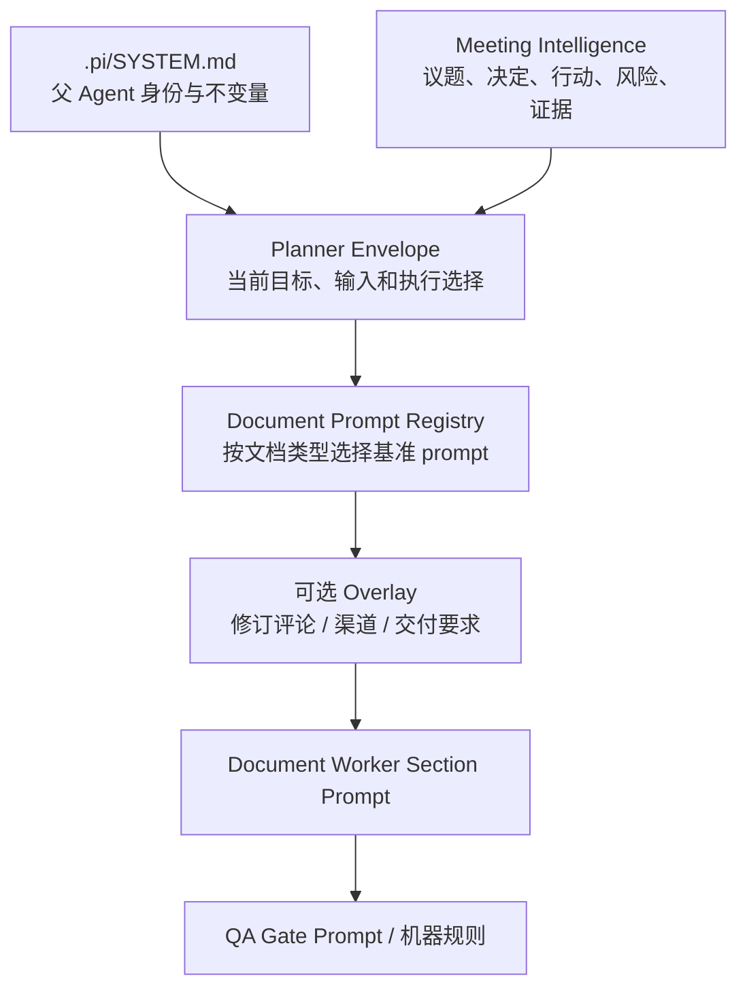

# System Prompt 与提示词架构

更新时间：2026-08-12。

当前提示词系统的目标是让 Agent 基于 Meeting Intelligence 自主选择能力，同时把证据、不确定性和外部动作边界保持清晰。本文说明契约，不复制生产 prompt 全文。

## 1. 提示词分层

| 层 | 真相源 | 职责 |
| --- | --- | --- |
| System | `.pi/SYSTEM.md` | 父 Agent 身份、委派规则、内容/凭证边界、最终责任 |
| Planning | Planner Envelope + execution profile | 当前任务目标、能力选择、模型和交付计划 |
| Meeting | `meeting-intelligence.json` | 当前会议语义和证据映射 |
| Document | `runtime/document-prompt-registry.json` + `prompts/*.md` | 会议纪要、PRD、架构、运营、确认清单的写作契约 |
| Revision | `prompts/document-revision-overlay.md` | 在基准 prompt 上叠加 review context，不另建流程 |
| QA | `qa-gate.schema.json` 与规则 | 证据覆盖、无证据实体、结构、发布阻断 |

## 2. System Prompt 当前原则

`.pi/SYSTEM.md` 必须表达：

- 先理解目标与证据，再选择 skill、extension、模型和工具。
- Meeting Intelligence 贯穿 Planner、检索、写作与 QA。
- 默认参会人代号；显式姓名映射优先，缺少姓名不阻塞。
- direct、single_subagent、dynamic_workflow 根据当前复杂度选择。
- 子 Agent 只核验，父 Agent 校验 segment id 并承担最终交付。
- 会议内容可供当前任务能力使用；凭证不能进入模型或产物。
- QA Gate 与 Policy Gate 分工，不用策略门替代业务推理。

## 3. 会议纪要 Prompt

`prompts/meeting-minutes.md` 接收的不是一段裸 transcript，而是由 Meeting Intelligence 与证据包组织的输入。它要求：

- 先判断会议类型和持续主议题，再动态组织章节。
- 区分 proposed、discussion、objection、agreed、rejected、unresolved。
- 不猜人名、owner、日期、金额或承诺。
- `needs_review` 只能进入风险或待确认，不能单独支撑确定结论。
- 原始长 transcript 保存在独立 artifact，不复制进纪要。
- 标题从参与方/角色、核心主题和关键安排推导，文件名与 H1 同步。

## 4. 文档 Prompt Registry

| 文档类型 | Prompt | 核心输出 |
| --- | --- | --- |
| `meeting_minutes` | `meeting-minutes.md` | 核心结论、议题、决定、行动、风险、待确认 |
| `prd` | `prd.md` | 用户、问题、范围、黄金路径、验收 |
| `tech_architecture` | `tech-architecture.md` | 上下文、组件、数据、流程、边界、验证 |
| `ops_plan` | `ops-plan.md` | 目标、阶段、责任、资源、风险、节奏 |
| `customer_requirement_checklist` | `customer-requirement-checklist.md` | 已确认、待确认、约束、后续问题 |

`document_prompt_render_batch` 负责把结构化 task input 渲染到 prompt；`document_workers_run` 按 section 执行并保持原顺序。文档结构归 prompt registry 所有，worker runtime 不硬编码业务模板。

## 5. Sub-agent 与 Workflow Prompt

会议角色位于 `.pi/agents/`：

- `meeting-evidence-analyst.md`：核验议题覆盖与证据。
- `meeting-decision-reviewer.md`：核验决定状态、异议与未决项。
- `meeting-action-reviewer.md`：核验行动内容、owner、due date 与证据。
- `meeting-evidence-synthesizer.md`：综合已经过 schema 约束的发现。

每个角色都必须收到明确任务、允许读取的 artifact、当前 segment id 范围和输出 schema。禁止让 child 自己决定发布、扩展工具或把常识写成会议事实。

## 6. 上下文管理

长 transcript 和完整 evidence 可以写入 offload artifact，并由 read/search 工具按需取回。主上下文保留任务相关片段、artifact path、hash、bounded preview、topic/evidence map、QA 状态和开放问题；这是容量与质量优化，不是内容不能被 Agent 使用。

以下内容必须在进入 prompt 前剔除：API Key、Token、Cookie、Authorization、App Secret、签名 URL、登录会话和可能包含它们的原始命令输出。`auth-status-summary` 只返回认证状态摘要；`secret-scan` 处理其他外部输出。

## 7. 质量检查

提示词质量不能只靠文案 review，至少检查：

- prompt placeholder 与 registry schema 一致。
- Meeting Intelligence 的重要判断在最终文档有覆盖。
- 每个确定结论都有当前 segment evidence。
- 同一实体不会因 speaker alias、姓名或 source 切换而串线。
- 子 Agent payload 未通过 reconciliation 时不会进入文档。
- 文档结构随会议变化，而不是固定填满模板。
- 失败和待确认以用户可理解的方式出现。

## 8. 维护规则

- 全局 Agent 行为只在 `.pi/SYSTEM.md` 维护。
- 文档类型结构只在 `prompts/*.md` 与 registry 维护。
- 角色只在 `.pi/agents/*.md` 维护。
- 代码中的提示词只允许用于工具调用说明、schema 约束和短运行指令，不复制整份文档 prompt。
- Hermes 只能生成 prompt/skill proposal；必须经过人工审阅和回归测试后才能合入。
