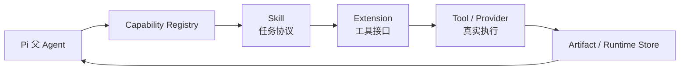

# Skill、Extension 与 Tool 设计

更新时间：2026-08-17。

本项目使用 Pi package 组织能力。Skill 说明“何时和怎样使用”，extension 注册可调用工具，tool 实现外部或本地执行，runtime JSON 定义 schema、registry 和 execution profile。父 Agent 根据任务惰性选择，不把所有能力预加载成固定 workflow。

## 1. 能力层次

## 2. 核心能力

| 能力 | 当前职责 | 默认加载 |
| --- | --- | --- |
| `planner-runtime` | 建立并 reconcile Adaptive Execution Ledger，派生 Todo 和解释能力选择 | 是 |
| `capability-registry` | 提供 planner-selectable capability descriptions 与 readiness | 是 |
| `policy-gate` | 判断凭证、发布、通知、删除、日历、任务和安装动作 | 是 |
| `qa-safety-review` | 判断证据覆盖、实体隔离、标题和发布阻断 | 是 |
| `runtime-observability` | 记录 plannerDecisions、policyDecisions、workerDecisions、capabilitySelections、packageAudits | 是 |
| `meeting-minutes` | 从 Meeting Intelligence 生成纪要 | 按需 |
| `office-source-analyst` / `office-deliverable-reviewer` | 复杂办公任务的独立来源分析与交付验收角色 | 按需 |
| `meeting-agentic-orchestration` | 选择 direct、fresh sub-agent 或 Dynamic Workflow | 按需 |
| `meeting-memory-curator` | QA 后提炼带 claim/segment 证据的长期记忆候选 | 完整音频会议按需 |
| `document-router` / `document-generation` | 选择和渲染文档 prompt | 按需 |
| `document-worker-runtime` | 执行有界 section writing | 按需 |
| `model-provider` | 调用主模型/审阅模型并记录 model route | 按需 |
| `feishu-agent-bridge` / `feishu-workflow` | 飞书上下文、文档与发布闭环 | 按需 |
| `rokid-lingzhu-workflow` | Rokid 素材导入和标准化 | 按需 |
| `context-offload` | 长上下文 artifact 化和按需读取 | 按需 |
| `public-url-source` | 解析显式公开媒体 URL，官方文稿优先，必要时云端 ASR，并输出 provenance-backed source pack | 按需 |
| `agent-team-runtime` | 旧本地 worker 兼容 fallback | 不作为主路径 |

## 3. ASR 能力

媒体能力由 `media-tools.ts`、`dashscope_asr_client.mjs`、`asr_media_formats.mjs`、`local_asr_*` 和单录混音 helper 组成。

- `auto` 在 DashScope/OSS 配置完整时选择云端文件 ASR。
- 文件上传使用 HTTP transcription endpoint；实时音频使用独立 WebSocket endpoint。
- 文件端接受 `.aac/.amr/.avi/.flac/.flv/.m4a/.mkv/.mov/.mp3/.mp4/.mpeg/.ogg/.opus/.wav/.webm/.wma/.wmv`。
- 实时端接受 `pcm/wav/mp3/opus/speex/aac/amr` 编码声明。
- 文件端 speaker diarization 可接收 2–100 人 hint；无 hint 时自动聚类。
- robust 单录混音使用双模型 diarization consistency review，将文本差异、speaker 冲突和 overlap 风险传入 QA。
- 本地 Qwen3-ASR 是显式 provider/fallback，不再定义产品可上传格式。

ASR 失败不得静默伪装成功；partial transcript 不能进入完整纪要。

### 公开 URL 来源

`public-url-source` skill 调用 `public_url_source_ingest`，其稳定底层入口是 `tools/public_url_source_cli.mjs`。来源适配、网络安全和 source pack 分别由 `public_url_source_helpers.mjs`、`public_url_security.mjs` 与 `public_url_source_pack_helpers.mjs` 负责；真实飞书入口复用 Task Router 与 execution runner。

- 支持 YouTube、播客/RSS、小宇宙单集和直接公开音视频 URL。
- 官方带时间戳文稿优先；没有可靠文稿时只走云端文件 ASR，不静默使用本地 ASR。
- YouTube 媒体适配复用 `yt-dlp`；RSS 使用标准 enclosure 与 Podcasting 2.0 transcript 元数据。
- 完整来源按章节建立有界模型 work unit，并校验每个 claim 的 segment id。
- `url_source_pack` 不加载 Meeting Intelligence、会议纪要、Document Workers 或发布器，也不写外部知识库。
- 外部 URL 获取前调用 Policy Gate，source pack 交付前调用 QA Gate；runner 只执行并记录结果，不拥有 Gate 判断。
- SSRF、重定向、公网 DNS、大小、时长、Cookie/凭证脱敏和 partial completion 是强制边界。

## 4. Agentic 编排能力

通用办公任务由父 Agent 维护 task state 与 artifact index；一个独立来源轴可委派 `office-source-analyst`，整合后可用 `office-deliverable-reviewer` 做目标/来源覆盖验收。会议场景的 `meeting_agentic_plan` 生成专项计划。真实执行由受限 Pi 父会话调用 `subagent` 或 `workflow`：

- `pi-subagents@0.46.0` 使用 `workflowScript` 和 `runs.run(...)`。
- `pi-dynamic-workflows@3.5.1` 使用 planner 生成的 script、args、background、concurrency、maxAgents 和 agentRetries。
- 只有真实 `tool_execution_end` 才算执行完成。
- 父级 `reconcilePiMeetingOrchestrationResult` 校验所有 segment id 与缺失的 `evidenceSegmentIds`。
- 不合格 payload 被隔离，不能被多数投票或 synthesizer 洗成会议事实。

## 5. 文档能力

`document-prompt-registry.json` 是文档类型与 prompt 的唯一映射。`document_prompt_render_batch` 创建 work unit，`context-pack-v2` 携带任务契约、task state、相关证据和 artifact index，`document_workers_run` 执行模型调用和 section 合并。worker 只写私有运行产物，不拥有飞书发布权限。

短答案与文件摘要保持父级直接处理；长 PRD、技术架构、多源综合可按 execution profile 进入 section worker。`document_revision` 在原 prompt 上叠加 review-context overlay，而不是建立第二套写作系统。

## 6. 记忆能力

- Pi 原生 Compaction 处理当前会话的短期上下文，不新增摘要服务。
- `meeting-memory-curator` 通过 `pi-subagents@0.46.0` 的一个 `runs.run(...)` 调用执行，固定 `context=fresh`、`tools=read`、project memory scope；不是 Dynamic Workflow，也不是常驻模型。
- `meeting_memory_helpers.mjs` 建立受限计划、解析结构化输出，并由父级校验 Meeting Intelligence claim 对 segment 的所有权。
- 父级持久化维护 `MEMORY.md`、append-only `ledger.jsonl` 和待审 `conflicts.jsonl`；低置信、越界、无 claim、凭证样内容会被拒绝。
- 记忆提炼属于非阻塞增强能力，不拥有飞书发布或生产配置写权限。

## 7. 飞书与渠道能力

- Event gateway 标准化消息、附件和 sender context。
- Handler 获取附件、构建 source context、调用 Agent、执行 QA/Policy、发布并回复。
- `lark-cli auth status --verify` 的结果只通过 `auth-status-summary` 暴露。
- 其他 CLI/OpenAPI 输出先过 `secret-scan`。
- “目前暂不支持该功能”只用于能力确实不存在且无安全替代时，不用于掩盖权限或运行故障。

## 8. 执行与安装边界

- Capability Registry 可以检查 PATH、环境变量和 package audit，但检查本身不安装依赖。
- 第三方 package 必须先有 `package-audit.schema.json` 对应记录，再加入 package manifest。
- `install_dependency` 属于 Policy Gate 动作，不能由 child Agent 自行执行。
- Pi package 的 extension、skill、prompt 入口以 `meeting-agent-pi-package/package.json` 为准。

## 9. 新增能力的最小要求

新增能力必须同时回答：

1. 哪类用户任务触发它？
2. 为什么父 Agent 现有能力不足？
3. 输入、输出和失败状态是什么？
4. 它读取哪些会议内容，是否可能接触凭证？
5. 谁验证结果，谁执行外部写动作？
6. 哪个 artifact 证明它真实运行？
7. 有哪些自动测试或真实 smoke？

若局部工具可以完成，不升级成新 Agent、服务或状态机。
