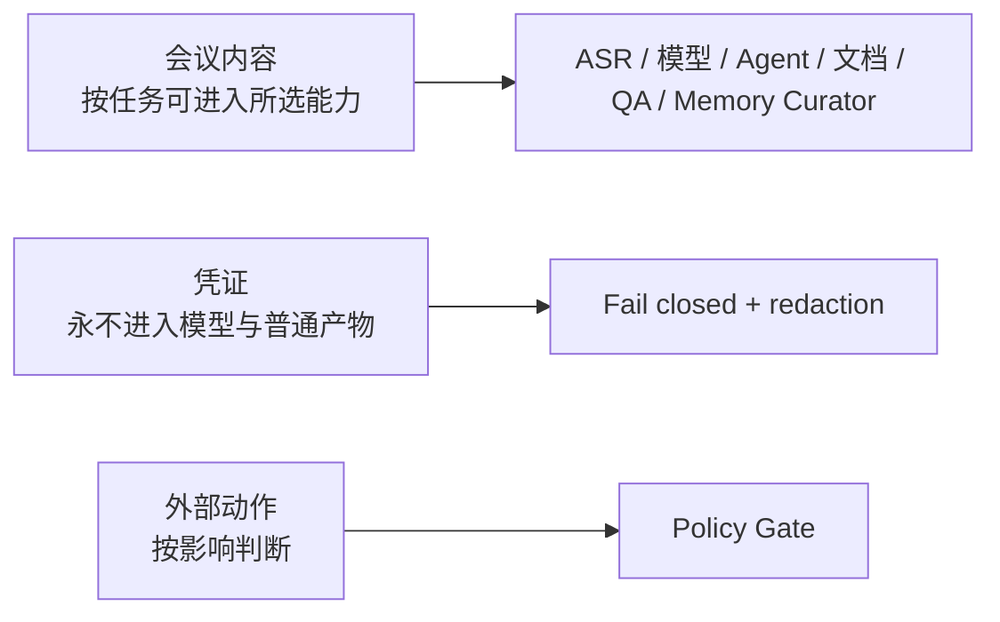

# 渠道、会议内容、凭证与外部动作边界

更新时间：2026-08-12。

当前系统不再用“会议内容默认不得离开本机”的规则限制 Agent。会议录音、转录、纪要和相关文件可以进入用户当前任务所选择的 ASR、模型、sub-agent、workflow、文档和 QA 能力。仍需严格保护的是凭证，以及会改变外部状态的高影响动作。

## 1. 三类边界

### 会议内容

允许按当前任务使用：录音、视频、transcript、会议纪要、附件正文、评论上下文、Meeting Intelligence 和证据映射。上下文分段、offload、检索与 bounded preview 用于性能和相关性，而不是阻止能力读取完整证据。

### 凭证

API Key、Token、Cookie、Authorization、App Secret、签名 URL、CLI session 和登录会话不得进入 prompt、普通日志、会议产物、metrics 或长期记忆。

### 外部动作

读取、分析和私有草稿通常可直接执行；删除、清空、通知他人、日历/任务变更、客户可见发布、权限扩大和依赖安装由 Policy Gate 返回 `pass`、`needs_confirmation` 或 `blocked`。

## 2. 渠道与数据路径

| 渠道 | 允许输入 | 主要处理 | 外部数据流 |
| --- | --- | --- | --- |
| 本地文件 | 音视频、文档、图片、文本 | hash、ASR/抽取、Meeting Intelligence | 仅发送给任务选中的 provider |
| 飞书 | 消息、附件、文档、评论 | CLI/OpenAPI 获取、Agent 处理、文档发布 | 飞书平台与所选模型/ASR |
| Rokid | 导出素材或 callback metadata | 标准化为本地 source context | 取决于素材来源和所选 provider |
| 智能眼镜 | 单路实时音频 | WebSocket ASR，结束后进入同一会议链路 | 配置的实时 ASR provider |

云端 ASR 会把原始媒体上传到已配置的 DashScope/OSS。运行产物必须记录真实 provider、endpoint 类型和 `rawMediaExternalUpload`；本地 provider 不上传媒体。

## 3. 文件 ASR 与实时 ASR

- 文件端：本地文件先传 OSS，再提交 DashScope HTTP transcription task，轮询完整结果。
- 实时端：编码音频帧通过 WebSocket 持续发送，不走 OSS 文件任务。
- 两者的 model、格式、超时、重试、diarization 能力和错误码分别配置，不混成一个 endpoint。
- OSS 临时对象和签名 URL 不写入普通 artifact；日志只保存 bucket/region 等非秘密配置摘要。

## 4. 飞书权限

飞书能力使用最小可用 scope，按功能拆分：

- 消息与附件读取：事件、消息资源和 Drive 文件读取。
- 文档生成/修订：Docx 创建、读取、更新和评论读取。
- 发布组织：Drive 目录或 Wiki node 创建/移动。
- 回复与通知：仅在用户请求的会话范围执行；扩大通知范围需确认。

`feishu_event_runner.mjs` 接事件，`feishu_agent_task_handler.mjs` 编排任务，发布 helper 负责目录/Wiki 组织。Handler 不决定文档内容结构。

认证检查使用 `lark-cli auth status --verify`，但 Agent 只看到 `auth-status-summary`。其他命令结果进入上下文前必须过 `secret-scan`。

## 5. Rokid 与智能眼镜

设备只负责采集和传输，不建立第二套 Agent 架构。导出文件走文件 ingestion contract；实时单路音频走 realtime ingestion contract。设备身份、会议身份和用户身份分别记录，避免把设备 owner 自动当作每段 speaker。

## 6. Docker 与长期记忆

- Docker worker 不接收飞书 token、App Secret、CLI session 或 cookie。
- `raw audio 不进容器`；Host 完成媒体获取和 ASR，worker 读取 transcript/evidence 或有界 context pack。
- `meeting-memory-curator` 只读取父 Agent 指定的已通过 QA 的文字证据，不能写文件、发布或修改生产 prompt/skill；父 Agent 负责凭证扫描、证据校验和持久化。
- 长期记忆与飞书发布解耦：发布失败不回滚已经验证的记忆，记忆失败也不阻塞纪要发布。

## 7. 动作判断示例

| 请求 | 默认判断 |
| --- | --- |
| 转录并在本地生成纪要 | `pass` |
| 在当前飞书会话创建用户明确要求的文档 | 可按 inbound 明确意图执行 |
| 给会议中所有人发送通知 | `needs_confirmation` |
| 创建/修改日历或分配任务 | `needs_confirmation` |
| 删除文档、清空目录或撤销权限 | `blocked` 或单独明确确认 |
| 安装新 package | 先 package audit，再 `needs_confirmation` |
| 把 credential 写入 prompt 方便调试 | `blocked` |

## 8. 运行证据

每次任务应能回答：数据进入了哪个 provider、是否上传 raw media、调用了哪些 Agent/tool、执行了哪些外部动作、Policy Gate 为什么通过或阻止。记录这些事实不等于记录原始密钥或完整会议正文。
