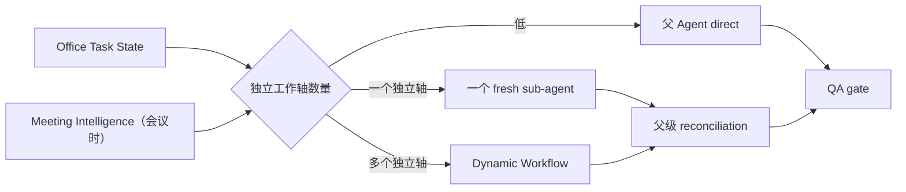

# Agent 与委派角色索引

更新时间：2026-08-12。

当前主架构不是常驻“Agent 团队”，而是一个 Office 父 Agent根据任务状态按需创建 fresh child，或运行有界 Dynamic Workflow。Meeting Intelligence 为会议场景提供委派信号；核验角色是任务模板。`meeting-memory-curator` 是唯一带 project memory scope 的持久角色，但每次仍以 fresh 子进程按需运行，不是常驻 LLM。

## 1. 角色索引

| 角色 | 定义 | 输入 | 输出 | 禁止事项 |
| --- | --- | --- | --- | --- |
| 父 Agent | `.pi/SYSTEM.md` | 用户目标、source context、Meeting Intelligence | 最终判断、文档、动作决策 | 不得跳过证据/QA |
| Office Source Analyst | `.pi/agents/office-source-analyst.md` | 单一来源轴与 task state | 事实、冲突、推断和缺口 | 不得生成最终交付或外部动作 |
| Office Deliverable Reviewer | `.pi/agents/office-deliverable-reviewer.md` | 交付物、任务契约和来源索引 | 目标/受众/来源覆盖审阅 | 不得因格式偏好机械阻断 |
| Evidence Analyst | `.pi/agents/meeting-evidence-analyst.md` | transcript 与 topic candidates | 议题覆盖、支持/冲突证据 | 不得决定发布 |
| Decision Reviewer | `.pi/agents/meeting-decision-reviewer.md` | decision candidates 与证据 | 决定状态、异议、未决项 | 不得把讨论写成共识 |
| Action Reviewer | `.pi/agents/meeting-action-reviewer.md` | action candidates 与证据 | action/owner/due 核验 | 不得补猜 owner/date |
| Evidence Synthesizer | `.pi/agents/meeting-evidence-synthesizer.md` | 已结构化 specialist 输出 | 去重、冲突与完整性摘要 | 不得创造新事实 |
| Document Worker | extension/runtime task | section prompt + context pack | Markdown section 与 QA 输入 | 不得发布飞书 |
| Memory Curator | `.pi/agents/meeting-memory-curator.md` | QA 通过的 Meeting Intelligence、纪要、participant map、transcript | 结构化长期记忆候选 | 不得写文件、发布或改生产 |

## 2. 选择规则

- 简短问答、简单文件摘要和低复杂度会议通常 direct。
- 只有一个明确的不确定轴，例如“行动项 owner 是否有证据”，使用 single_subagent。
- 多议题、多决定、多行动项、明显冲突或多处低置信证据时使用 dynamic_workflow。
- 会议时长只是信号，不是唯一阈值。

## 3. 执行契约

- `pi-subagents@0.46.0`：`workflowScript` + `runs.run(...)`。
- `pi-dynamic-workflows@3.5.1`：执行 planner 生成的 workflow script，并限制 concurrency、maxAgents 和 agentRetries。
- 受限父会话只开放 `read,subagent,workflow`。
- 模型路线优先审阅模型，失败时显式尝试主模型；attempts 写入 `model-route.json` 或 agentic artifact。
- 工具必须出现 `tool_execution_end`；只生成计划或文字摘要不算执行。
- child 返回事实性发现时必须包含 `evidenceSegmentIds`。
- 父级 `workerDecisions` 和 reconciliation 记录接受、隔离或 fallback 原因。
- Memory Curator 的事实候选还必须引用 `sourceClaimIds`；父 Agent 校验 claim 对当前 segment 的所有权，去重并隔离同 key 冲突。

## 4. 与旧 runtime 的关系

`extensions/agent-team-runtime.ts` 和 `skills/agent-team-runtime/` 保留动态 worker 组件兼容路径，提供 planner-selectable capability descriptions、`workerDecisions` 和排序/并发上限。它不再作为当前会议 Agent 的默认编排器，也不应在新文档中称为固定团队或主路径。

## 5. 完整链路

通用链路为：目标与 task state → source/artifact index → direct/sub-agent/workflow → 父级整合 → document/answer → QA → 必要的 Policy → delivery。会议在 source 后增加 ASR、Meeting Intelligence、segment reconciliation 与按需 Memory Curator。

这是可自适应的会议场景链路，不是全局 fixed workflow。上下文 offload 可按容量使用；它不会阻止 child 在被授权任务内读取完整会议证据。
