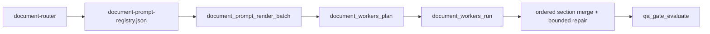

# 当前项目架构与代码映射

更新时间：2026-08-12。

本文把 [Agent 专项架构](02-agent-architecture.md) 映射到当前仓库代码。若描述与实现冲突，以代码、runtime JSON、schema 和 lockfile 为准。

## 1. 总体架构

```mermaid
flowchart LR
    Input["本地 / 飞书 / Rokid / 智能眼镜"] --> Adapter["Channel 与 File Adapters"]
    Adapter --> Router["Task Router + Execution Profile"]
    Router --> ASR["File ASR / Realtime ASR"]
    Router --> Context["Source Context"]
    ASR --> Context
    Context --> MI["Meeting Intelligence"]
    MI --> Planner["Pi Parent + Agentic Planner"]
    Planner --> Capability["Capability Registry"]
    Planner --> Delegation["Direct / Sub-agent / Workflow"]
    Delegation --> Reconcile["Parent Evidence Reconciliation"]
    Reconcile --> Prompt["Prompt Registry"]
    Prompt --> Worker["Document Workers"]
    Worker --> QA["QA Gate"]
    QA --> Policy["Policy Gate"]
    Policy --> Delivery["Local / Feishu Delivery"]
    Delivery --> Hermes["Hermes Sidecar"]
```



这是一组可组合能力，不是所有任务都执行的固定 DAG。`fast_answer`、`file_summary`、`audio_minutes`、`document_generation`、`document_revision`、`multi_source_synthesis` 和 `publish_only` 由 `runtime/execution-profiles.json` 决定最小所需阶段。

## 2. 仓库分层

| 路径 | 当前职责 |
| --- | --- |
| `.pi/SYSTEM.md` | 父 Agent 全局工作方式与不变量 |
| `.pi/agents/` | Meeting specialist 的 fresh context 角色定义 |
| `meeting-agent-pi-package/extensions/` | Pi callable tools 与运行控制接口 |
| `meeting-agent-pi-package/skills/` | 能力触发、操作协议和边界 |
| `meeting-agent-pi-package/prompts/` | 正式文档 prompt 与修订 overlay |
| `meeting-agent-pi-package/runtime/` | registry、schema、provider、profile、model route、package audit |
| `meeting-agent-pi-package/tools/` | ASR、飞书、runner、runtime store、Docker 与 helper 实现 |
| `hermes-learning-sidecar/` | 事后复盘和改进 proposal |
| `AgentWorkbench/` | macOS 只读运行观测 |
| `wiki/` | 当前规范与历史证据 |
| `runtime-runs/` | 已忽略的真实运行产物、cache 和服务状态 |

## 3. 决策所有权

| 组件 | 拥有的判断 | 不拥有的判断 |
| --- | --- | --- |
| Task Router | task intent、execution profile | 模型、prompt、文档结构、事实结论 |
| Parent / Planner | 目标拆解、能力选择、委派、停止条件 | provider 的底层实现 |
| Model Router | provider/model 候选与显式 fallback | 会议事实 |
| Prompt Registry | docType、正式 prompt、required sections | 外部发布权限 |
| Document Worker | section batch、合并、bounded repair | 最终证据接受、飞书发布 |
| QA Gate | 证据、实体、结构和可交付质量 | 外部动作授权 |
| Policy Gate | 凭证与外部动作边界 | 会议业务流程和内容结构 |
| Handler / Adapter / Publisher | 转换、执行、记录和回复 | 不重新做 Planner 判断 |
| Hermes | 事后 proposal | 不直接改生产能力 |

## 4. Pi 与 Agentic 运行

当前基线：Node `>=22.19.0`、Pi `0.84.1`、`pi-subagents@0.46.0`、`@quintinshaw/pi-dynamic-workflows@3.5.1`。

关键实现：

- `extensions/meeting-agentic-orchestrator.ts` 注册 `meeting_agentic_plan`。
- `tools/meeting_workflow_helpers.mjs` 根据 Meeting Intelligence 生成 direct/single/dynamic 计划。
- `tools/pi_meeting_orchestration_helpers.mjs` 启动受限非交互 Pi，解析 `tool_execution_end`，并执行父级 segment id reconciliation。
- `.pi/agents/*.md` 定义 evidence、decision、action 和 synthesis 角色。
- `extensions/agent-team-runtime.ts` 是旧动态 worker 兼容路径，不是主编排器。

审阅模型优先，失败后显式尝试主模型；每个 attempt 可审计。工具执行完成与证据接受分开记录。

## 5. ASR 与单录混音

| 路径 | 接口 | 默认模型 | Speaker 能力 |
| --- | --- | --- | --- |
| 云端文件 | OSS + HTTP asynchronous transcription | `fun-asr` | diarization，2–100 人 hint，mono |
| 云端实时流 | WebSocket | `paraformer-realtime-v2` | 当前不声明 diarization |
| Robust review | 同一文件的独立复核 | `paraformer-v2` | 文本/speaker/overlap 一致性，不做声源分离 |
| 本地 fallback | loopback HTTP | Qwen3-ASR | 归一化 WAV，取决于本地 provider |

`asr_media_formats.mjs` 定义产品格式矩阵，`dashscope_asr_client.mjs` 实现文件与实时端口，`asr_diarization_helpers.mjs` 只在 provider 需要 mono 时生成派生文件，`single_mix_asr_helpers.mjs` 生成冲突与待确认证据。原媒体不修改。

## 6. Meeting Intelligence

`meeting_intelligence_helpers.mjs` 以 transcript/evidence 和用户输入生成：

- `artifacts/meeting-intelligence/meeting-analysis.json`
- `meeting-profile.json`
- `participant-map.json`
- `topic-map.json`
- `evidence-map.json`
- `agent-plan.json`
- `agentic-orchestration.json`
- `agentic-orchestration-result.json`

participant map 使用稳定 `参会人 A/B/...`，显式姓名映射覆盖显示名。模型生成的 topic/decision/action 先经过当前 segment id、participant alias 和 quality 规则校验，再进入写作。

## 7. 文档链路



文档结构只在 `prompts/*.md` 和 registry 中维护。Runner 同步生成 `document-title-plan.json`，使 Markdown H1、文件名和飞书标题一致。`document_revision` 复用原 docType prompt，并追加 `document-revision-overlay.md` 与 source-scoped review context。

## 8. 飞书入口与交付

- `feishu_event_runner.mjs`：推荐的 CLI event consume 入口，标准化并转发事件。
- `feishu_bot_event_gateway.mjs`：可选 SDK 长连接入口，转发到同一 handler。
- `feishu_agent_task_handler.mjs`：拥有 run lifecycle、附件获取、runner 调用、发布和回复。
- `task_router.mjs`：选择 execution profile。
- `task_execution_runner.mjs`：执行 profile 阶段，并接入 ASR、Meeting Intelligence、Agentic 委派、文档和 gate。
- `feishu_publish_taxonomy.mjs` / `feishu_wiki_publish_helpers.mjs`：决定归档树与执行 Wiki/Drive 发布。

用户可见回复不暴露 runId、凭证、内部 stack 或 raw provider response。失败回复提供可理解原因和恢复方向。

## 9. Source Context 与 Office Runtime

`im_file_context_helpers.mjs` 处理附件识别、提取和 preview；`source-context-runtime.ts` 建立 source record、segment、retrieval plan、context pack 和 generation gate。完整内容可按任务读取，bounded context 用于相关性和模型预算。

`office-runtime.ts` 管理 document lifecycle、office object reference、retrieval index 和 memory proposal。检索索引保存 hash、摘要、preview 和 artifact pointer，不复制完整正文；这属于索引设计，不是会议内容调用禁令。

## 10. Host、Docker 与 Store

运行边界是 **Host 原生控制面 + Local Docker 受限执行面**。本地 Docker 不能减少本机总计算消耗。

- Host 拥有飞书凭证、`lark-cli`、附件、ASR、父 Agent、发布、回复和 Host-owned SQLite。
- `fast_answer/file_summary 不进 Docker`。
- `document_generation/multi_source_synthesis 默认进 Docker worker`，但只有 queue 模式开启时实际入队。
- `raw audio 不进容器`；worker 读取 transcript/evidence/context pack。
- Docker worker 不调用飞书、不直接写 SQLite，只回传产物给 Host 登记。
- 默认资源档位为 `4 CPU / 8GB / 长文档并发 2`。

```bash
docker compose -f docker-compose.local-runtime.yml up -d runtime-queue pi-document-worker hermes-worker
```

Store 细节见 [14-local-data-storage-cache-backend.md](14-local-data-storage-cache-backend.md)。

## 11. 运行产物

一次完整任务通常包含：

- channel：`event.json`、`task.json`、`state.json`、`reply.json`。
- source：`file-context.json`、source records/segments/context packs。
- ASR：`summary.json`、完整/可读 transcript、evidence index、cloud events、single-mix analysis。
- intelligence：participant/topic/evidence/agent plan 与 agentic result。
- model/document：`model-route.json`、title plan、Markdown、worker results。
- gate/delivery：QA、Policy、publish、manifest、metrics。

`runtime-runs/` 不进入 Git。AgentWorkbench 只读这些产物；Hermes 读取完成学习任务所需的 trajectory，但不会接触凭证。

## 12. 当前已知限制

- 单路混音无法保证恢复完全重叠的多人语音。
- 实时 WebSocket 路径目前不声明 speaker diarization。
- 当前审阅模型配置在一次真实 smoke 中返回 401，运行时会记录并回退主模型；凭证/权益仍需独立修复。
- AgentWorkbench 在部分 CommandLineTools 环境缺少 XCTest/Swift Testing，使用 build + executable smoke 验证。
- WeChat 仍是本地 fixture adapter skeleton，不承诺正式在线收发。
