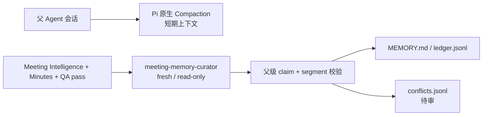
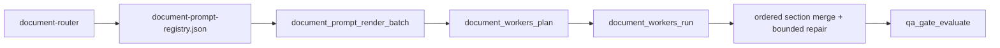

# 当前项目架构与代码映射

更新时间：2026-08-17。

> Planner 已升级为 `adaptive-execution-ledger-v1`，Meeting Intelligence 新增 `productDiscovery`、PRD readiness、客户澄清问题和 Todo/下一步投影。细节见 [15-adaptive-execution-ledger-and-product-discovery.md](15-adaptive-execution-ledger-and-product-discovery.md)。

本文把 [Agent 专项架构](02-agent-architecture.md) 映射到当前仓库代码。若描述与实现冲突，以代码、runtime JSON、schema 和 lockfile 为准。

## 1. 总体架构

```mermaid
flowchart LR
    Input["本地 / 飞书 / Rokid / 智能眼镜"] --> Adapter["Channel 与 File Adapters"]
    Adapter --> Router["Task Router + Execution Profile"]
    Router --> Task["Parent Task State + Artifact Index"]
    Router --> ASR["File ASR / Realtime ASR"]
    Router --> URL["Public URL Resolver"]
    URL --> Source["Official Transcript\nor Bounded Media + Cloud ASR"]
    Source --> Pack["Chapter Analysis + Source Pack"]
    Task --> Context["Work-unit Source Context"]
    ASR --> Context
    Context --> MI["Meeting Intelligence"]
    MI --> Planner["Pi Parent + Agentic Planner"]
    Planner --> Capability["Capability Registry"]
    Planner --> Delegation["Direct / Sub-agent / Workflow"]
    Delegation --> Reconcile["Parent Evidence Reconciliation"]
    Reconcile --> Prompt["Prompt Registry"]
    Prompt --> Worker["Document Workers"]
    Worker --> QA["QA Gate"]
    QA --> Memory["On-demand Memory Curator\n+ Parent Validation"]
    QA --> Policy["Policy Gate"]
    Policy --> Delivery["Local / Feishu Delivery"]
    Pack --> Delivery
```



这是一组可组合能力，不是所有任务都执行的固定 DAG。`fast_answer`、`file_summary`、`url_source_pack`、`audio_minutes`、`document_generation`、`document_revision`、`multi_source_synthesis` 和 `publish_only` 由 `runtime/execution-profiles.json` 决定最小所需阶段。

## 2. 仓库分层

| 路径 | 当前职责 |
| --- | --- |
| `.pi/SYSTEM.md` | 父 Agent 全局工作方式与不变量 |
| `.pi/agents/` | Meeting specialist 的 fresh context 角色定义 |
| `.pi/agent-memory/` | 父级校验后的项目长期记忆；运行数据，已忽略 |
| `meeting-agent-pi-package/extensions/` | Pi callable tools 与运行控制接口 |
| `meeting-agent-pi-package/skills/` | 能力触发、操作协议和边界 |
| `meeting-agent-pi-package/prompts/` | 正式文档 prompt 与修订 overlay |
| `meeting-agent-pi-package/runtime/` | registry、schema、provider、profile、model route、package audit |
| `meeting-agent-pi-package/tools/` | ASR、飞书、runner、runtime store、Docker 与 helper 实现 |
| `AgentWorkbench/` | macOS 只读运行观测 |
| `wiki/` | 当前规范与历史证据 |
| `runtime-runs/` | 已忽略的真实运行产物、cache 和服务状态 |

## 3. 决策所有权

| 组件 | 拥有的判断 | 不拥有的判断 |
| --- | --- | --- |
| Task Router | task intent、execution profile | 模型、prompt、文档结构、事实结论 |
| Parent / Planner | 目标拆解、task state、artifact index、能力选择、委派、停止条件与验收 | provider 的底层实现 |
| Model Router | provider/model 候选与显式 fallback | 会议事实 |
| Prompt Registry | docType、正式 prompt、required sections | 外部发布权限 |
| Document Worker | section batch、合并、bounded repair | 最终证据接受、飞书发布 |
| QA Gate | 证据、实体、结构和可交付质量 | 外部动作授权 |
| Policy Gate | 凭证与高影响/不可逆/目标不明的外部动作边界 | 办公业务流程和内容结构 |
| Handler / Adapter / Publisher | 转换、执行、记录和回复 | 不重新做 Planner 判断 |
| Public URL Resolver | 来源分类、官方文稿/媒体取得、网络与限额校验 | 不把节目解释成会议，不决定外部知识库写入 |
| Memory Curator | QA 后长期记忆候选 | 不写文件、不发布、不绕过父级证据校验 |
| Parent Memory Governance | claim/segment 校验、去重、冲突隔离与写入 | 不自动覆盖冲突，不把低置信内容升级为事实 |

## 4. Pi 与 Agentic 运行

当前基线：Node `>=22.19.0`、Pi `0.84.1`、`pi-subagents@0.46.0`、`@quintinshaw/pi-dynamic-workflows@3.5.1`。

关键实现：

- `extensions/meeting-agentic-orchestrator.ts` 注册 `meeting_agentic_plan`。
- `tools/meeting_workflow_helpers.mjs` 根据 Meeting Intelligence 生成 direct/single/dynamic 计划。
- `tools/pi_meeting_orchestration_helpers.mjs` 启动受限非交互 Pi，解析 `tool_execution_end`，并执行父级 segment id reconciliation。
- `.pi/agents/*.md` 定义 evidence、decision、action 和 synthesis 角色。
- `.pi/agents/meeting-memory-curator.md` 定义唯一的 project-scoped 持久记忆角色；每次运行仍是 fresh、只读的单次子 Agent。
- `.pi/settings.json` 启用 Pi 原生 Compaction，并让 sub-agent 从 Git root 解析项目角色。
- `tools/meeting_memory_helpers.mjs` 构造单 sub-agent 计划，执行父级证据 reconciliation、去重、冲突记录与项目记忆写入。
- `extensions/agent-team-runtime.ts` 是旧动态 worker 兼容路径，不是主编排器。

审阅模型优先，失败后显式尝试主模型；每个 attempt 可审计。工具执行完成与证据接受分开记录。

## 5. ASR 与单录混音

| 路径 | 接口 | 默认模型 | Speaker 能力 |
| --- | --- | --- | --- |
| 云端文件 | OSS + HTTP asynchronous transcription | `fun-asr` | diarization，2–100 人 hint，mono |
| 云端实时流 | WebSocket | `paraformer-realtime-v2` | 当前不声明 diarization |
| Robust review | 同一文件的独立复核 | `paraformer-v2` | 文本/speaker/overlap 一致性，不做声源分离 |
| 本地 fallback | loopback HTTP | Qwen3-ASR | 归一化 WAV，取决于本地 provider |

`asr_media_formats.mjs` 定义产品格式矩阵，`dashscope_asr_client.mjs` 实现文件与实时端口，`asr_diarization_helpers.mjs` 只在 provider 需要 mono 时生成派生文件，`single_mix_asr_helpers.mjs` 生成冲突与待确认证据。原媒体不修改。

## 6. 公开 URL 与 Source Pack

`task_router.mjs` 把用户明确提供的 YouTube、播客/RSS、小宇宙单集或直接公开音视频 URL 路由到 `url_source_pack`。`public_url_security.mjs` 校验协议、公网 DNS、每次重定向、大小和时长；`public_url_source_helpers.mjs` 解析来源并优先取得官方带时间戳文稿。没有可靠文稿时，runner 复用 OSS + DashScope 文件 ASR，禁止静默本地 fallback。

长 transcript 由 `public_url_source_pack_helpers.mjs` 按官方章节或有界时间窗拆分。模型只接收当前章节片段，输出的每个 claim 都必须引用现有 segment id。网络获取前调用真实 Policy Gate；交付前调用真实 QA Gate 检查完整转写、章节与 provenance。最终 source pack 保存在 `runtime-runs/public-url/` 或飞书 run 的 `artifacts/` 下；不进入 Meeting Intelligence、会议纪要或外部知识库发布。

## 7. Meeting Intelligence

`meeting_intelligence_helpers.mjs` 以 transcript/evidence 和用户输入生成：

- `artifacts/meeting-intelligence/meeting-analysis.json`
- `meeting-profile.json`
- `participant-map.json`
- `topic-map.json`
- `evidence-map.json`
- `agent-plan.json`
- `agentic-orchestration.json`
- `agentic-orchestration-result.json`

participant map 使用稳定 `参会人 A/B/...`，显式姓名映射覆盖显示名。模型也可输出带 segment evidence、basis 和 confidence 的姓名候选，但候选不覆盖 displayName，也不能确定 owner/承诺。topic/decision/action 先经过当前 segment id、participant alias 和 quality 规则校验，再进入写作。

## 8. 双层记忆



Curator 不运行在 Docker，也不使用 Dynamic Workflow。它只读取父 Agent 指定的文字 artifact，结构化返回项目事实、决定、用户确认身份、术语与开放问题候选。父 Agent 是唯一写入者；记忆失败不阻塞会议交付。

## 9. 文档链路



文档结构只在 `prompts/*.md` 和 registry 中维护。Runner 同步生成 `document-title-plan.json`，使 Markdown H1、文件名和飞书标题一致。`document_revision` 复用原 docType prompt，并追加 `document-revision-overlay.md` 与 source-scoped review context。

## 10. 飞书入口与交付

- `feishu_event_runner.mjs`：默认的 CLI event consume 入口，保持消费进程 stdin、标准化并转发事件。
- `feishu_bot_event_gateway.mjs`：设置 `FEISHU_INBOUND_MODE=sdk` 时使用的可选 SDK 长连接入口，转发到同一 handler。
- `feishu_agent_task_handler.mjs`：拥有 run lifecycle、附件获取、runner 调用、发布和回复。
- `task_router.mjs`：选择 execution profile。
- `task_execution_runner.mjs`：执行 profile 阶段，并接入 ASR、Meeting Intelligence、Agentic 委派、文档和 gate。
- `public_url_source_cli.mjs`：本地稳定入口，复用同一 runner 并返回 source pack 路径。
- `feishu_publish_taxonomy.mjs` / `feishu_wiki_publish_helpers.mjs`：决定归档树与执行 Wiki/Drive 发布。

用户可见回复不暴露 runId、凭证、内部 stack 或 raw provider response。失败回复提供可理解原因和恢复方向。

## 11. Source Context 与 Office Runtime

`im_file_context_helpers.mjs` 处理附件识别、提取和 preview；`source-context-runtime.ts` 建立 source record、segment、task state、artifact index、retrieval plan、`context-pack-v2` 和 generation gate。父级保留控制状态，worker 只拿任务契约与相关证据；完整内容可按任务补取并重建 pack。

`office-runtime.ts` 管理 document lifecycle、office object reference 和 retrieval index。检索索引保存 hash、摘要、preview 和 artifact pointer，不复制完整正文；这属于索引设计，不是会议内容调用禁令。长期记忆只走 Memory Curator 与父级治理路径，不再由 office-runtime 提供第二套 proposal 入口。

## 12. Host、Docker 与 Store

运行边界是 **Host 原生控制面 + Local Docker 受限执行面**。本地 Docker 不能减少本机总计算消耗。

- Host 拥有飞书凭证、`lark-cli`、附件、ASR、父 Agent、发布、回复和 Host-owned SQLite。
- `fast_answer/file_summary 不进 Docker`。
- `document_generation/multi_source_synthesis 默认进 Docker worker`，但只有 queue 模式开启时实际入队。
- `raw audio 不进容器`；worker 读取 transcript/evidence/context pack。
- Docker worker 不调用飞书、不直接写 SQLite，只回传产物给 Host 登记。
- 默认资源档位为 `4 CPU / 8GB / 长文档并发 2`。

```bash
docker compose -f docker-compose.local-runtime.yml up -d runtime-queue pi-document-worker
```

Store 细节见 [14-local-data-storage-cache-backend.md](14-local-data-storage-cache-backend.md)。

## 13. 运行产物

一次完整任务通常包含：

- channel：`event.json`、`task.json`、`state.json`、`reply.json`。
- source：`file-context.json`、source records/segments/context packs。
- ASR：`summary.json`、完整/可读 transcript、evidence index、cloud events、single-mix analysis。
- URL source：`source-metadata.json`、`source-resolution.json`、完整/可读 transcript、章节分析、`source-pack.json`、`source-pack.readable.md` 与 provenance `evidence-index.json`。
- intelligence：participant/topic/evidence/agent plan 与 agentic result。
- memory：curation plan/result/events；长期视图与 ledger 位于忽略的 `.pi/agent-memory/meeting-memory/`。
- model/document：`model-route.json`、title plan、Markdown、worker results。
- gate/delivery：QA、Policy、publish、manifest、metrics。

`runtime-runs/` 与 `.pi/agent-memory/` 不进入 Git。AgentWorkbench 只读 run 产物；Memory Curator 只读取父 Agent 指定的已通过 QA 的文字证据，不接触凭证或原始媒体。

## 14. 当前已知限制

- 单路混音无法保证恢复完全重叠的多人语音。
- 实时 WebSocket 路径目前不声明 speaker diarization。
- 当前审阅模型配置在一次真实 smoke 中返回 401，运行时会记录并回退主模型；凭证/权益仍需独立修复。
- AgentWorkbench 在部分 CommandLineTools 环境缺少 XCTest/Swift Testing，使用 build + executable smoke 验证。
- WeChat 仍是本地 fixture adapter skeleton，不承诺正式在线收发。
- YouTube 无官方字幕时要求运行环境安装 `yt-dlp`；平台规则变化或受限内容会返回 blocked，而不是尝试 Cookie/登录绕过。
