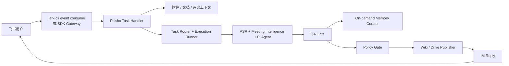
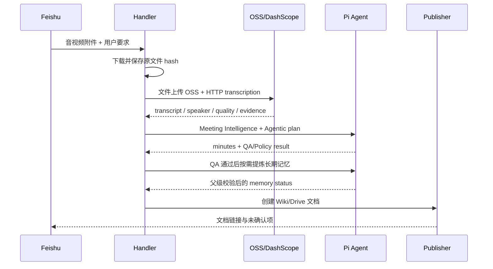

# 飞书双向 Agent 集成规范

更新时间：2026-08-13。

> 飞书回复已可展示 Execution Ledger Todo；同一 thread/chat 中用户选择 PRD、客户需求确认表、技术架构或运营方案时，handler 会关联上一轮 Ledger 与来源 artifact，形成后续文档任务。

文件名保留早期 `plan` 后缀以避免外部链接失效；本文描述的是当前实现，不是未来计划。

## 1. 目标与边界

飞书是 Meeting Agent 的第一办公入口：用户在会话中发送自然语言、附件或文档修订请求，系统异步处理并把可读结果发布回飞书。飞书层只负责渠道上下文、附件、发布和回复；会议理解与文档结构仍归 Pi Agent。



## 2. 入口

推荐入口：

```bash
node meeting-agent-pi-package/tools/feishu_agent_task_handler.mjs \
  --host 127.0.0.1 --port 8788 \
  --publish-mode dry-run --reply-mode dry-run

node meeting-agent-pi-package/tools/feishu_event_runner.mjs \
  --event-key "$FEISHU_EVENT_KEY" \
  --handler-url http://127.0.0.1:8788/feishu/events
```

- CLI-first：`lark-cli event consume` → `feishu_event_runner.mjs` → handler。
- 可选 SDK：`feishu_bot_event_gateway.mjs` 订阅 `im.message.receive_v1`，转发到同一 handler。
- 长任务使用 `FEISHU_AGENT_ASYNC=1`；HTTP 返回接受状态，最终结果由 handler 回复。
- Gateway 和 handler 通过 `suppressGatewayReply` 避免重复回复。

## 3. 事件与状态

标准化事件至少包含 channel、actor、conversation、message、attachments、parent/root context 和 source。Handler 在 `runtime-runs/feishu-agent/runs/{runId}/` 维护状态。

用户侧状态：已接受、处理中、需要补充信息、已完成、暂不支持、失败可重试。用户可见文本不包含本地 runId、内部 QA/Policy 名称、凭证、provider stack 或原始错误体。

## 4. 附件与上下文

附件解析优先级：当前消息附件/显式 URL → parent/root 资源 → 同 chat/sender/thread 的近期 cache。Cache 必须按 modality 过滤，旧音频不能覆盖当前文档请求。

- 音视频：进入文件 ASR；不再局限于旧六种音频扩展名。
- PDF/Word/Excel/Markdown/TXT/CSV：生成 file context 和 source segments。
- 飞书云文档修订：读取正文及 source-scoped comment threads。
- 多附件：合并为一个 source context manifest，但保持 source id 隔离。

## 5. 音频会议纪要



云端文件 ASR 与实时流 WebSocket 分端口。文件端默认 `fun-asr`，可启用匿名 diarization；robust 模式使用 `paraformer-v2` 复核。Local Qwen3-ASR 是显式 fallback。`rawMediaExternalUpload` 必须真实记录。

ASR partial、零 segment 或所有 provider 失败时阻止完整纪要，不把残缺内容当成完整会议。

## 6. 文档生成与修订

新文档按 Prompt Registry 生成会议纪要、PRD、技术架构、运营方案和客户需求确认清单。`document-title-plan.json` 同步 H1、Markdown 文件名和飞书展示名。

修订现有文档时：

1. 用户提供明确 token/link，或目标是本会话已生成文档。
2. 优先通过 CLI comment API 读取独立评论，SDK 只作同 API fallback。
3. `review-context.json` 按 `sourceDocuments[].comments[]` 分组。
4. comment quote 只在同一 source 正文匹配，状态为 exact/fuzzy/unmatched 等。
5. 原 docType prompt + revision overlay 进入同一 Document Worker。
6. 权限不足必须记录 `comment_api_permission_blocked`，不能假装读到批注。

## 7. 发布组织

默认 `FEISHU_AGENT_PUBLISH_TARGET=auto`：优先 Wiki，权限/移动失败时显式记录并回落 Drive。

- Taxonomy 从 project title、docType、purpose 和 source thread 生成项目树。
- 同源会议纪要、PRD、架构和 checklist 进入同一项目节点。
- Publisher 执行创建/移动，不修改文档事实或 gate 结论。
- 历史重整只使用无删除迁移；不得破坏旧 token/url。

## 8. 权限与策略

- 明确的当前会话非删除写作/发布请求可以执行。
- 删除、清空、扩大通知范围、日历/任务变更和权限扩大按 Policy Gate 处理。
- `auth-status-summary` 用于认证摘要，`secret-scan` 用于可能含凭证的输出。
- OSS 签名 URL、App Secret、Token 和 session 不进入 Agent prompt 或普通产物。

## 9. 失败恢复

| 失败 | 用户结果 | 本地证据 |
| --- | --- | --- |
| 附件无权限/过期 | 请求重新发送或补 scope | attachment attempts |
| ASR 鉴权/格式/网络失败 | 说明转录未完成，不生成完整纪要 | ASR summary/events |
| 模型失败 | 显式 fallback；全部失败则保留 evidence | model-route attempts |
| Agentic 委派失败 | 父级 review，注明未完成委派 | agentic result/events |
| QA blocked | 返回待确认或修复项，不发布 | qa-gate artifact |
| Memory Curator 失败/冲突 | 不阻塞纪要；记录 blocked 或待审冲突 | meeting-memory artifact |
| Wiki 权限不足 | 显式 Drive fallback 或本地交付 | publish artifact |
| 回复失败 | 文档仍保留，提供可重试状态 | reply artifact |

## 10. 验收

- 同一事件只处理一次；长任务不会因 HTTP 超时丢失。
- 附件 source 不串线；当前附件优先级正确。
- 音视频格式按云端文件矩阵识别，文件/实时 endpoint 不混用。
- Meeting Intelligence 和 agentic artifacts 可追踪。
- QA/Policy 通过后才发布；用户收到真实链接或可恢复失败。
- “目前暂不支持该功能”只用于没有实现的能力，不隐藏权限或 provider 故障。
