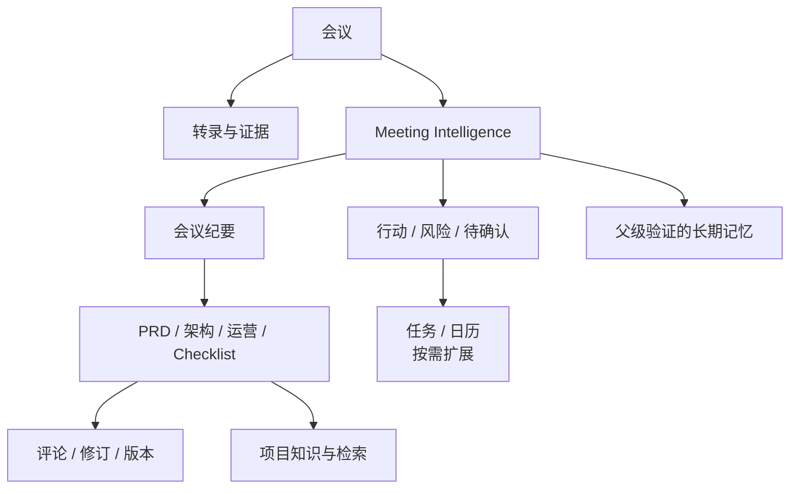

# Office Agent 产品与技术边界

更新时间：2026-08-12。

当前产品中心已经上移为 Office Agent：围绕用户目标组织来源、推理、文档、协作和外部动作。会议理解是最成熟的垂直能力模块，并继续为会议后办公资产提供高质量结构化输入。

## 1. 当前判断

- 已可用：会议转录、Meeting Intelligence、纪要、多类型文档、飞书收发、文档修订、QA/Policy、运行观测、Pi 原生 Compaction 与证据约束的项目长期记忆。
- 正在产品化：任务进度、失败恢复、真实飞书权限体验、多人长会议质量、智能眼镜单路实时输入。
- 尚未形成完整产品：日历/任务双向生命周期、语义级跨项目知识检索、正式 WeChat 接入、多人协作管理后台。

## 2. 产品对象

核心对象应围绕 meeting、source、participant、topic、decision、action、document、publish target 和 run 组织，而不是围绕渠道复制状态机。

## 3. 渠道策略

飞书、本地、Rokid、智能眼镜和未来 WeChat 共用统一 ingestion/task/source contract：

- Adapter 只把渠道事件、附件和回复能力映射到统一结构。
- 智能眼镜的单路实时流结束后进入同一 Meeting Intelligence 和文档链路。
- 设备 owner 不自动等于 speaker；实名可来自用户映射或已登记声纹身份，其他声音/上下文判断只作为带依据和置信度的候选。
- 渠道没有某项能力时返回真实 capability gap，不建立假的兼容层。

## 4. Agentic 产品体验

Agentic 能力对用户的价值应表现为：系统主动发现主要议题、冲突、决定缺口和下一步，能在复杂会议中调用独立核验者，并解释哪些内容需要确认。用户不需要理解 sub-agent 数量、workflow script 或内部模型路线。

默认交互：

1. 用户提供会议输入和期望结果。
2. 系统可非阻塞询问实名映射，也可提出有依据的姓名候选供用户确认。
3. 先交付转录与纪要。
4. 基于会议内容提出 PRD/架构/行动清单等建议。
5. 用户选择后再生成或执行高影响动作。

## 5. 扩展判据

新能力应优先作为现有能力的 profile、skill 或 tool，只有同时满足以下条件才引入新 Agent/服务：

- 有独立、反复出现的任务责任。
- 输入输出可以清晰隔离并独立验证。
- 父 Agent 单次工具调用不能简单完成。
- 新状态不会与 Meeting Intelligence 或 runtime store 冲突。
- 用户能获得可见价值，而不是只增加内部复杂度。

## 6. 近期演进

- 智能眼镜：接入 realtime ingestion contract，保留单路音频限制。
- 会议后续建议：从 Meeting Intelligence 生成可选择的下一步，不自动制造文档。
- 任务/日历：先从明确 action item 的草稿和确认开始，再扩展双向状态同步。
- 项目知识：通过 source/run/document reference 检索，保持证据来源和版本可见。
- Workbench：补充 Meeting Intelligence、agentic reconciliation 和 provider attempts 的只读视图。
- 项目长期记忆：先稳定 claim/segment 证据、去重与冲突审阅，再考虑跨项目检索；不建立常驻 LLM 服务。

## 7. 不扩展的方向

- 常驻多 Agent 组织和 Agent 间聊天网络。
- 为每个渠道建立独立会议 pipeline。
- 让未知声纹聚类凭空产生真实身份，或让候选身份绑定责任与承诺。
- 在单路混音上承诺声源分离级恢复。
- 常驻记忆 LLM、Memory Curator 自行写入、或根据记忆自动修改生产 prompt、skill 和策略。
- 在真实需求出现前预建多租户权限平台。

## 8. 成功标准

Office Agent 的升级只有在用户能更少说明上下文、更快得到可信结果、理解失败和继续行动时才有价值。模型调用数量、Agent 数量、workflow 长度和文档数量都不是独立成功指标。
