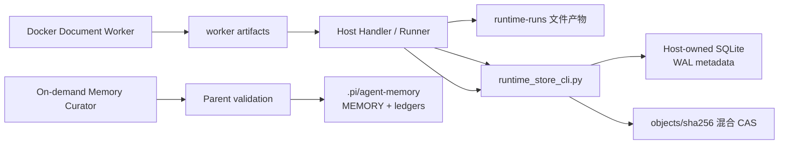

# 本地运行存储、缓存与保留策略

更新时间：2026-08-12。

当前后端是文件 artifact + **Host-owned SQLite** metadata + 混合 CAS。它治理 `runtime-runs/` 中的会议输入、ASR、文档、worker 和发布产物；项目长期记忆另存在已忽略的 `.pi/agent-memory/`，不引入外部数据库作为本地真相源。

## 1. 架构



Host 是唯一数据库写入者。**Docker worker 不直接写 SQLite**；它只写文件结果，由 Host 拉回后登记。Memory Curator 不写任何存储，父 Agent 在校验后写项目记忆。

## 2. 存储组成

| 层 | 内容 | 真相角色 |
| --- | --- | --- |
| Run directory | 事件、任务、source、ASR、Meeting Intelligence、模型、文档、gate、发布 | 单次运行详细证据 |
| SQLite | run/artifact/source/cache/job/publish/retention metadata | 索引、查询、生命周期 |
| CAS | 按 SHA-256 去重的大文件对象 | 本地内容去重 |
| Recent source/cache | 同会话附件复用、文本提取和 ASR 命中 | 性能优化，可重建 |
| Project memory | `MEMORY.md`、accepted ledger、conflict ledger | 跨会议复用的已验证少量事实；不是完整会议档案 |

SQLite 启用 WAL、foreign keys 与 busy timeout。主要表包括 runs、artifacts、source_refs、recent_sources、file_text_cache、asr_cache、worker_jobs、publish_records、retention_policies 和 `retention_actions`。

## 3. 混合 CAS

`runtime_store_cli.py put-object` 计算 SHA-256，将适合去重的文件写入 `objects/sha256/`，再根据文件系统能力使用 hardlink、symlink 或 copy。Run 目录仍保留可读 artifact path，因此现有 contract 不需要迁移成纯对象数据库。

CAS 规则：

- 原文件身份由 hash 而不是扩展名决定。
- 会议 fixture 默认不进入生产索引。
- 同一原媒体的云端/本地 ASR cache key 还必须包含 provider、model、input mode、diarization 和 single-mix 配置。
- 签名 URL、Token 或完整 request body 不进入 CAS metadata。

## 4. Source 与 Cache

`find-source` 按 channel/conversation/sender/thread、file key、hash、modality 和 freshness 查找可复用 source。当前附件和显式 URL 优先，recent cache 只作 fallback。

文本 cache 保存提取结果的路径、hash 和版本；ASR cache 保存完整成功产物的引用。partial、零 segment、failed chunk、fixture pollution 或签名不匹配的媒体不得成为 ready cache。

## 5. 三档生命周期

当前采用**三档生命周期**：

| 档位 | 典型内容 | 处理方式 |
| --- | --- | --- |
| 热 | 当前 run、待发布、待恢复任务、近期 source | 保持 run path，优先复用 |
| 温 | 已完成 transcript、文档、证据、重要模型/QA artifact | 可 CAS 去重，按 TTL/容量保留 |
| 冷/临时 | normalized media、stream logs、fixture、可重建 cache | 优先过期和容量清理 |

Pinned、未完成、待发布和显式保留内容不会被普通 cleanup 删除。远端飞书对象不受本地 cleanup 影响。

## 6. Retention 与 LRU

Cleanup 同时考虑 TTL、artifact kind quota 和 **LRU**。超过 `KIND_MAX_BYTES` 时，从未 pinned、已完成、可安全删除的最久未使用对象开始回收；所有候选与结果写入 `retention_actions` 和每日 retention report。

默认只生成 dry-run 计划：

```bash
python3 meeting-agent-pi-package/tools/runtime_store_cli.py cleanup
python3 meeting-agent-pi-package/tools/runtime_store_cli.py dedupe
```

只有明确使用 `cleanup --execute` 或 `dedupe --execute` 才改变文件。`safe_cleanup_path` 限制删除范围在 runtime root 内。

## 7. 常用命令

```bash
python3 meeting-agent-pi-package/tools/runtime_store_cli.py init
python3 meeting-agent-pi-package/tools/runtime_store_cli.py index-run --run-dir <run-dir> --cas
python3 meeting-agent-pi-package/tools/runtime_store_cli.py find-source --file-key <file-key>
python3 meeting-agent-pi-package/tools/runtime_store_cli.py audit-pollution
python3 meeting-agent-pi-package/tools/runtime_store_cli.py quarantine-artifact --sha256 <sha256>
python3 meeting-agent-pi-package/tools/runtime_store_cli.py dedupe --dry-run
python3 meeting-agent-pi-package/tools/runtime_store_cli.py cleanup --dry-run
```

Handler 通过 `FEISHU_AGENT_RUNTIME_STORE_MODE`、`FEISHU_AGENT_RUNTIME_STORE_CAS` 和 `FEISHU_AGENT_RUNTIME_STORE_TIMEOUT_MS` 控制索引行为。

## 8. 数据边界

- 完整 transcript、原媒体和文档正文可以保存在 run artifact/CAS，供当前任务能力使用。
- SQLite 主要保存 metadata、状态、路径、hash、TTL 和 bounded preview，不复制大正文。
- 凭证、Authorization、Cookie、App Secret、OSS 签名和 CLI session 不进入数据库或 artifact。
- `raw audio 不进 Docker`，但云端 ASR 可按配置把媒体上传到 DashScope/OSS。
- Workbench 只读；Memory Curator 只提候选，父 Agent 写记忆；远端发布由 Host 执行。

## 9. 恢复与审计

- Store 失败不应破坏已生成文件；Handler 记录 indexing failure 并保留 run。
- `audit-pollution` 检查 fixture/无效 raw media 混入。
- `quarantine-artifact` 隔离本地索引对象，不删除远端飞书文件。
- 每次 cleanup/dedupe 均可从 retention report 和 `retention_actions` 复查。
- 数据库可由存在的 run 目录重新索引，不成为不可恢复的单点。
