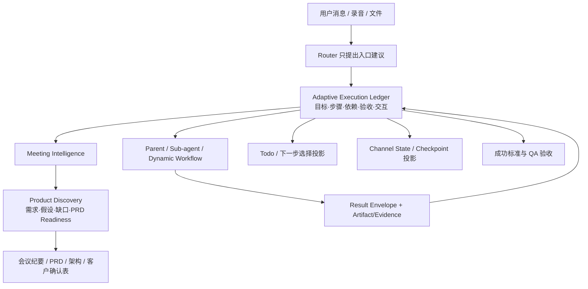

# Adaptive Execution Ledger 与产品发现能力

## 1. 产品结果

Office Agent 不只把会议转成纪要，还要帮助产品、FDE 和开发团队把客户口中的模糊表达变成可继续确认、可进入 PRD、可验收的产品输入。

本轮后端升级形成两条连接在一起的能力：

1. `Adaptive Execution Ledger`：复杂任务的唯一执行状态源。
2. `productDiscovery`：从会议证据中提取客户问题、工作流、期望结果、约束、假设、验收信号和澄清问题。

Todo 不再是一份独立清单，而是 Ledger 的用户可见投影。它既能展示任务进度，也能在 ASR、会议纪要或产品发现结束后向用户给出下一步选择。

## 2. 核心架构



### 状态所有权

| 层 | 职责 | 是否可决定完成 |
|---|---|---|
| Execution Ledger | 目标、步骤、依赖、状态、验收、交互、Artifact 指针 | 是 |
| Meeting Intelligence | 会议事实与产品发现语义 | 否，提供证据和观察 |
| Sub-agent / Workflow | 完成隔离工作单元，返回 result envelope | 否 |
| Document checkpoint | 章节级恢复 | 否 |
| Todo / 飞书回复 | 给用户展示进度、问题与选择 | 否 |

## 3. Todo 的用户价值

Todo 有两类内容：

- 进度项：ASR、会议理解、纪要、PRD、QA 等步骤状态；用户可见但不直接修改执行证据。
- 交互项：需要用户回答的问题、可选后续交付物、Agent 建议；用户可以选择、补充、删除或重排。

典型结束状态：

```text
已完成：录音转写、会议纪要

下一步与待确认：
- 先审阅 4 个客户需求问题
- 生成带待确认项的 PRD
- 生成客户需求确认表
- 暂时只保留会议纪要

用户也可以直接补充自己的下一步。
```

只有答案会改变产品范围、技术架构、开发优先级或验收方式时，Todo 才把问题提升为用户选择。普通可逆实现细节由 Agent 自主推进。

## 4. 产品发现模型

`productDiscovery` 包含：

- `opportunitySignals`：潜在需求和价值机会。
- `userProblems`：客户明确或推断的问题/痛点。
- `targetUsers`：使用者、决策者和协作角色。
- `workflows`：当前工作流、触发、输入、动作、输出和摩擦。
- `desiredOutcomes`：客户想得到的结果和价值时刻。
- `constraints`：范围、权限、技术、数据、交付和商业约束。
- `assumptions`：Agent 或团队尚未验证的产品假设。
- `acceptanceSignals`：怎样才算解决、怎样验收。
- `clarificationQuestions`：下一次最值得向客户或内部团队确认的问题。
- `prdReadiness`：`ready / needs_clarification / insufficient`。

所有条目区分 `confirmed`（证据明确支持）、`inferred`（合理推断）和 `unresolved`（证据不足或未收敛）。PRD 可以在 `needs_clarification` 状态生成，但必须保留需求与假设分层；高优先级缺口不能被静默补齐。

## 5. 客户问题优先级

下一轮问题不追求数量，而按影响排序：

1. 不确认会改变要解决的用户问题或 MVP 范围。
2. 不确认会导致架构、数据、权限或部署方案重做。
3. 不确认就无法写出可测试的验收标准。
4. 不确认会影响交付责任、预算、周期或客户承诺。
5. 仅影响表达、排版或可逆实现的细节不应阻塞。

每个问题要带确认对象、为什么问、不确认阻塞什么和关联证据。已明确事实不得伪装成问题。

## 6. 运行约束

- Planner 必须在文档 worker 启动前完成；Planner blocked 时不得继续。
- 依赖循环必须阻塞，不能把剩余任务放入同一并行 wave。
- 有 acceptance 的步骤，没有 result reference 或明确验收通过时不得 completed。
- 子 Agent 不直接修改 Ledger；父 Agent reconcile。
- Todo、频道状态和 Context Pack 中的 Task State 均作为 Ledger 投影使用。
- 前端不是本轮范围；当前通过 Pi Tool、飞书回复及 JSON artifact 暴露能力。
- 飞书会按 thread/chat scope 索引上一轮 Ledger；用户回复“生成 PRD / 客户确认表 / 技术架构”等已展示选项时，先记录原 Ledger 的用户选择，再复用上一轮 Meeting Intelligence、会议纪要和 Ledger artifact 启动后续文档任务。

## 7. 当前边界

- 运行时仍保留 profile runner 负责具体 stage 实现；它应逐步改为消费 Ledger 的 ready steps，而不再独立判断任务真相。
- Product Discovery 是证据分析，不替代真实客户确认。
- 实时会议提示需要后续桌面/移动端承载；本轮只输出后端结构和交互投影。
