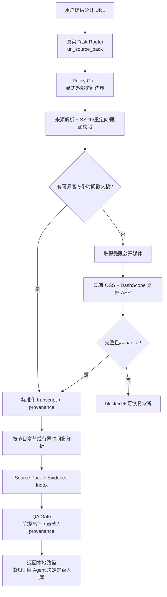

# 公开媒体 URL 与知识 Source Pack

更新时间：2026-08-17。

该能力把用户在本地 Agent 或飞书中明确提供的公开视频/音频 URL 转成可审计的知识交接包。第一批支持 YouTube、播客 RSS/单集、小宇宙单集和直接公开音视频 URL。它不直接写入外部知识库，也不把播客误当会议。

## 黄金路径



官方字幕/节目文稿保留来源 URL、格式和发布时间信息。节目简介、show notes、自动摘要指针和无时间戳短文本不是完整文稿；它们只能补充元数据或章节提示。YouTube 解析复用 `yt-dlp`，不维护自制媒体签名解析器。

## 输入、状态与 Todo

- 明确 URL 会经 `task_router.mjs` 进入 `url_source_pack`，飞书 handler 与本地 CLI 共用 `task_execution_runner.mjs`。
- 完整成功后，飞书回复包含来源结果、关键观点预览、可交互下一步和本地 `source-pack.readable.md` 交接路径；不会因收到 URL 就自动发布或写入外部知识库。
- Adaptive Execution Ledger 依次投影“解析 URL、获取文稿或媒体、云端转写、章节分析、生成交接包、验证 provenance”。
- Policy Gate 在网络获取前记录显式公网访问决策；QA Gate 在交付前真实验证完整转写、章节完成度、claim 证据和 provenance。Runner 不自行伪造 Gate 通过结果。
- 官方文稿存在时跳过媒体下载与 ASR；跳过的依赖被记录，不伪装成已执行。
- 网络、来源、字幕、媒体、ASR 或章节分析失败时，任务停在 `blocked` 并给出恢复方向；部分结果不生成完整 source pack。

## 产物

默认运行目录为 `runtime-runs/public-url/runs/{runId}/`：

| 产物 | 内容 |
| --- | --- |
| `artifacts/public-source/source-metadata.json` | 原始/最终来源 URL、平台、标题、作者/节目、发布日期、时长、语言、获取方式与处理时间 |
| `artifacts/public-source/source-resolution.json` | 文稿/媒体选择、诊断、限额与 fallback 状态 |
| `artifacts/transcripts/transcript.full.json` | 官方文稿或完整云端 ASR 的结构化时间戳片段 |
| `artifacts/transcripts/transcript.readable.md` | 可读转录与质量说明 |
| `artifacts/public-source/source-pack/source-pack.json` | 章节、关键观点、分类判断、开放问题和关联主题 |
| `artifacts/public-source/source-pack/source-pack.readable.md` | 面向知识库 Agent/用户审阅的可读交接包 |
| `artifacts/public-source/provenance/evidence-index.json` | claim → transcript segment → 官方文稿或 ASR 来源映射 |
| `policy-gate.json` / `qa-gate.json` | 实际外部访问决策与 source pack 可交付验收 |

完整媒体、逐字稿和诊断留在已忽略运行目录，不进入公开 Git。source pack 区分 `explicit_fact`、`author_view`、`agent_inference`、`controversy_or_risk` 与 `open_question`；模型只能分析当前章节的结构化片段，不能一次性读取整段长媒体。

## 本地调用

```bash
node meeting-agent-pi-package/tools/public_url_source_cli.mjs \
  --url "https://www.xiaoyuzhoufm.com/episode/..."
```

stdout 返回机器可读状态和 `sourcePackPath`。只验证元数据与获取计划时使用：

```bash
node meeting-agent-pi-package/tools/public_url_source_cli.mjs \
  --url "https://example.com/media" \
  --resolve-only
```

Pi 对话使用 `public_url_source_ingest` 工具；飞书中的显式 URL 自动进入同一 profile。

YouTube 依赖 `yt-dlp` 和 `ffprobe`；macOS 可运行 `brew install yt-dlp ffmpeg`。可执行文件路径可用 `YT_DLP_BIN`、`FFPROBE_BIN` 覆盖，但解析器固定禁用 Cookie、浏览器 Cookie、playlist 和 live。真实环境验证、成本与脱敏 artifact hash 见 [17-public-url-live-validation.md](17-public-url-live-validation.md)。

## 安全与已知边界

- 只允许 HTTP(S) 公网目标；初始地址、DNS 结果和每次重定向都必须通过校验。
- 阻止 localhost、内网/保留地址、URL 内凭证、危险重定向、超大响应、超大媒体和超长时长。
- 不使用浏览器 Cookie、Authorization 或未授权签名 URL，不绕过登录、付费墙、DRM、地区限制或平台访问控制。
- 产物中的 URL 会移除签名/凭证类 query 参数，异常输出也会脱敏。
- YouTube 无官方字幕时依赖本机可用的 `yt-dlp`；缺失或平台限制会返回可恢复诊断，不伪造成功。
- 小宇宙公开页若仅暴露媒体和文稿指针，会明确计划云端 ASR；平台元数据中的限制信号会保留为诊断。
